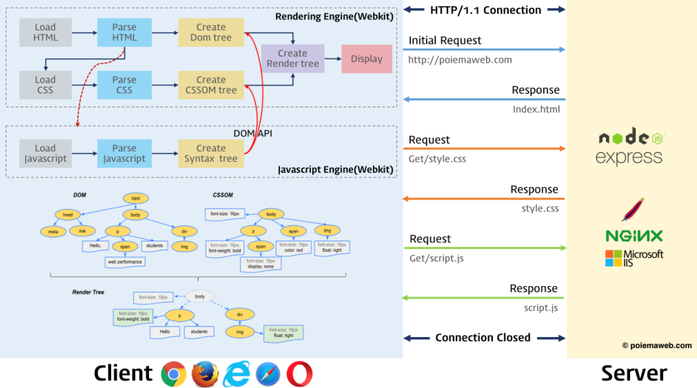
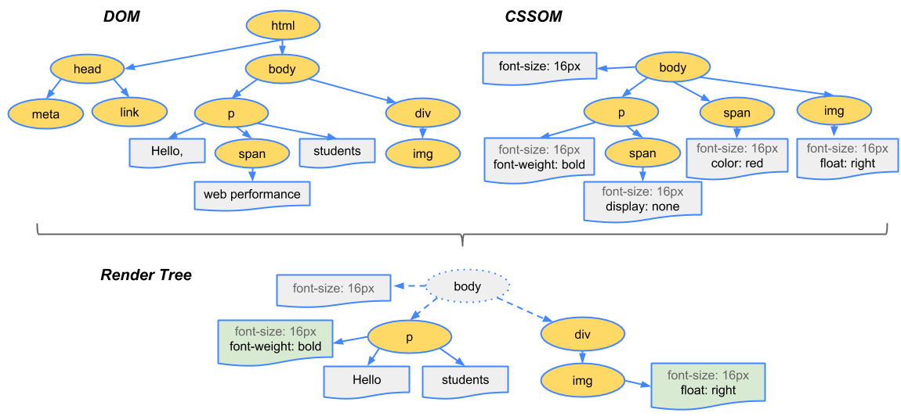
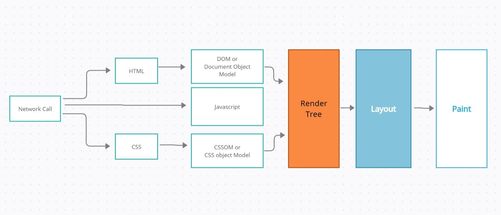

여러 프로그래밍 언어는 운영체제나 가상 머신 위에서 실행됩니다. 그러나 자바스크립트는 클라이언트 사이드로 브라우저에서 HTML, CSS와 함께 실행됩니다. 자, 이를 위해 브라우저가 HTML, CSS, 자바스크립트로 작성된 텍스트 문서를 어떻게 파싱하여 브라우저 렌더링을 하는지 알아봅시다!

> **파싱(Parsing, 구문 분석)**
> - 파싱은 텍스트 문서를 읽어 실행하기 위해 문자열을 토큰(token)으로 분해(Lexical Analysis, 어휘 분석)하고 토큰에 문법적 의미와 구조를 반영하여 파스 트리(parse tree/syntax tree)를 생성하는 일련의 과정을 말합니다.
> - 일반적으로 파싱이 완료된 이후에서는 파스 트리를 기반으로 중간 언어(Intermediate code)인 바이트 코드(Bytecode)를 생성하고 실행합니다.

> **렌더링(Rendering)**
> - HTML, CSS, 자바스크립트로 작성된 문서를 파싱하여 브라우저에 시각적으로 출력하는 것입니다.

브라우저는 아래와 같은 과정을 통해 렌더링을 수행합니다.

<br>

<div align='center'>



</div>

<br>

1. 브라우저는 HTML, CSS, 자바스크립트, 이미지, 폰트 파일 등 렌더링에 필요한 리소스를 요청하고 서버로부터 응답을 받습니다.
2. 브라우저의 렌더링 엔진은 서버로부터 응답된 HTML과 CSS를 파싱하여 DOM과 CSSOM을 생성하고 이들을 결합하여 렌더링 트리를 생성합니다.
3. 브라우저의 자바스크립트 엔진은 서버로부터 응답된 자바스크립트를 파싱하여 AST(Abstract Syntax Tree)를 생성하고 바이트코드로 변환하여 실행합니다. 이때 자바스크립트는 DOM API를 통해 DOM이나 CSSOM을 변경할 수 있습니다. 변경된 DOM과 CSSOM은 다시 렌더링 트리로 결합됩니다.
4. 렌더링 트리를 기반으로 HTML 요소의 레이아웃(위치와 크기)을 계산하고 브라우저 화면에 HTML 요소를 페인팅합니다.

## 요청과 응답
> 브라우저의 핵심 기능은 필요한 리소스(Resource, 자원)를 서버에 요청(Request)하고 서버로부터 응답(Response) 받아 시각적으로 렌더링하는 것입니다.

렌더링에 필요한 리소스(HTML, CSS, 자바스크립트, 이미지, 폰트 등 `정적 파일`과 `서버가 동적으로 생성한 데이터`)는 모두 서버에 존재합니다. 따라서 필요한 리소스를 서버에 요청하고 서버가 응답한 리소스를 파싱하여 렌더링하는 것이죠.

그럼 어떻게 서버에 요청하고 리소스를 응답 받을까요? 아래에 그 절차를 간랸히 나열했으니 찬찬히 살펴봅시다.

- 1️⃣ 브라우저 주소창에 www.google.com을 검색하면 URL의 호스트 이름이 DNS를 통해 IP 주소로 변환되고, IP 주소를 갖는 서버에게 요청을 전송합니다. 루트 요청이 구글 웹 서버로 전송되면 서버는 대부분 암묵적으로 index.html을 응답하도록 되어 있습니다.

- 2️⃣ 서버는 루트 요청에 대해 정적파일 index.html을 클라이언트로 응답하고, 브라우저는 응답 받은 index.html을 파싱합니다. 만약 브라우저의 렌더링 엔진이 HTML을 파싱하는 도중 외부 리소스를 로드하는 태그인 link, img, script 태그 등을 만나면 HTML 파싱을 일시 중지하고 해당 리소스 파일을 서버로 요청합니다.

- 3️⃣ 중간에 link태그를 만나 CSS요청이 발생하면 요청과 응답을 거쳐 CSS를 파싱합니다.

- 4️⃣ CSS 파싱이 완료되면 CSSOM(CSS Object Model)을 생성한 뒤 중단된 지점부터 HTML을 다시 파싱합니다.

- 5️⃣ 중간에 script태그를 만나면 javascript 코드를 실행하기 위해 파싱을 중단합니다.

- 6️⃣ 제어 권한을 자바스크립트 엔진에게 넘기고, 자바스크립트 엔진은 자바스크립트를 해석하여 AST(Abstract Syntax Tree, 추상적 구문 트리)를 생성합니다.

- 7️⃣ AST를 기반으로 인터프리터가 실할 수 있는 중간 코드(Intermediate Code)인 바이트코드를 생성하여 실행합니다.

- 8️⃣ 자바스크립트 파싱과 실행이 종료되면 렌더링 엔진으로 제어 권한을 넘기고 HTML 파싱이 중단 지점부터 HTML을 다시 파싱합니다.

- 9️⃣ HTML 파싱이 완료되면 브라우저가 이해할 수 있는 구조인 DOM(Document Object Model)을 생성합니다.

- 🔟 완성된 DOM과 CSSOM을 합쳐 렌더링 트리(Render Tree)로 결합합니다.

> 이러한 요청과 응답은 개발자 도구의 `Network` 패널에서 확인할 수 있습니다.

이 요청과 응답은 어떻게 일어나는 걸까요? 이 부분은 네트워크의 지식이 필요합니다. 세부적으로 들어가므로 차후 다루도록 할게요.

그래도 `HTTP/1.1`과 `HTTP/2.0`에 대해서는 조금 언급할 필요가 있겠네요.

<br>

## `HTTP/1.1`과 `HTTP/2.0`
> HTTP(HyperText Transfer Protocol)는 웹에서 브라우저와 서버가 통신하기 위한 프로토콜입니다.

<br>

<div align='center'>


</div>

<br>

`HTTP/2.0`은 `HTTP/1.1`의 가장 큰 문제점인 회전 지연(Latency)를 해결하기 위해 제안되었습니다.

`HTTP/1.1`의 요청-응답 메세지 포맷은 구현의 단순성, 접근성을 중점으로 최적화 되었습니다. 하나의 요청에 하나의 응답만을 받는(1:1) HTTP 메세지 교환 방식은 응답을 받아야만 다음 요청을 보낼 수 있으므로 심각한 회전 지연이 발생했습니다. 병렬 커넥션, 파이프라인 커넥션 등이 도입 되었지만 이를 완전히 해결하진 못했죠.

`HTTP/2.0`은 기존의 요청-응답과는 약간 다른 서버 푸시(Server Push)를 도입하여 요청을 명시적으로 받지 않아도 능동적으로 클라이언트에 리소스를 전송할 수 있게 되었습니다.

그 차이점은 아래와 같습니다.

1. HTTP/2.0의 모든 메세지는 프레임에 담겨 전송됩니다.

<br>

2. 스트림(Stream)과 멀티 플렉싱(Multi-flexing)을 지원합니다.
   - 하나의 커넥션에 여러 스트림이 동시에 열리거나 우선순위를 가질 수 있습니다.

<br>

3. 헤더를 압축하여 보내므로 중복된 내용을 효과적으로 처리할 수 있습니다.

<br>

4. 서버 푸시가 도입되어 클라이언트가 능동적으로 리소스를 푸시합니다.

<br>

5. 효율적인 페이지 로딩을 위해 URL 이미지, 스크립트 등의 리소스를 압축하여 요청을 감소시킵니다.

<br>

자, 이제 우리는 브라우저의 렌더링에 대해 구체적으로 알아봅니다. [구글의 렌더링 최적화](https://developers.google.com/web/fundamentals/performance/critical-rendering-path/constructing-the-object-model?hl=ko) 글을 참고해주세요.

<br>

## 객체 모델 생성
> 브라우저가 페이지를 렌더링하려면 먼저 DOM 및 CSSOM을 생성해야 합니다. 따라서 HTML 및 CSS를 가능한 한 빨리 브라우저에 제공해야 하죠.

- `바이트 → 문자 → 토큰 → 노드 → 객체 모델`
- HTML 마크업은 DOM(Document Object Model)으로 변환되고, CSS 마크업은 CSSOM(CSS Object Model)으로 변환됩니다.
- DOM 및 CSSOM은 서로 독립적인 데이터 구조입니다.
- Chrome DevTools Timeline을 사용하면 DOM 및 CSSOM의 생성 및 처리 비용을 수집하고 점검할 수 있습니다.

### DOM(Document Object Model)
```html
 <!DOCTYPE html>
<html>
  <head>
    <meta name="viewport" content="width=device-width,initial-scale=1">
    <link href="style.css" rel="stylesheet">
    <title>Critical Path</title>
  </head>
  <body>
    <p>Hello <span>web performance</span> students!</p>
    <div></div>
  </body>
</html> 
```

<br>

<div align='center'>


</div>

<br>

- 1️⃣ 변환: 브라우저가 HTML의 원시 바이트를 디스크나 네트워크에서 읽고 해당 파일에 대해 지정된 인코딩(예: UTF-8)에 따라 개별 문자로 변환합니다.
- 2️⃣ 토큰화: 브라우저가 문자열을 W3C HTML5 표준에 지정된 고유 토큰으로 변환합니다(예: '', '' 및 꺽쇠괄호로 묶인 기타 문자열). 각 토큰은 특별한 의미와 고유한 규칙을 가집니다.
- 3️⃣ 렉싱: 방출된 토큰은 해당 속성 및 규칙을 정의하는 `객체`로 변환됩니다.
- 4️⃣ DOM 생성: HTML 마크업이 여러 태그(일부 태그는 다른 태그 안에 포함되어 있음) 간의 관계를 정의하기 때문에 생성된 객체는 트리 데이터 구조 내에 연결됩니다. 이 트리 데이터 구조에는 원래 마크업에 정의된 상위-하위 관계도 포합됩니다. 즉, HTML 객체는 body 객체의 상위이고, body는 paragraph 객체의 상위인 식입니다.

이 전체 프로세스의 최종 출력이 이 페이지의 DOM(Document Object Model)이며, 브라우저는 이후 모든 페이지 처리에 해당 DOM을 사용합니다.

**브라우저는 HTML 마크업을 처리할 때마다 위의 모든 단계를 수행합니다**. 즉, 바이트를 문자로 변환하고 토큰을 식별한 후 노드로 변환하고 DOM 트리를 빌드합니다. 이 전체 프로세스를 완료하려면 시간이 약간 걸릴 수 있고 처리해야 할 HTML이 많은 경우 더욱 걸립니다.

<br>

## CSSOM(CSS Object Model)
> 브라우저는 단순한 페이지의 DOM을 생성하는 동안 문서의 head 태그에서 외부 CSS 스타일시트와 연결된 link 태그를 만납니다.

페이지를 렌더링하는 데 이 리소스가 필요할 것이라고 판단한 브라우저는 이 리소스에 대한 요청을 즉시 발송하고 아래의 컨텐츠가 응답됩니다.

```css
body { font-size: 16px }
p { font-weight: bold }
span { color: red }
p span { display: none }
img { float: right } 
```

HTML 마크업 내에 인라인으로 스타일을 선언할 수도 있지만 CSS를 HTML과 별도로 유지하면 컨텐츠와 디자인을 별도의 항목으로 처리할 수 있습니다. 즉, 디자이너는 CSS를 처리하고, 개발자는 HTML에만 집중할 수 있죠.

HTML과 마찬가지로, 수신된 CSS 규칙을 브라우저가 이해하고 처리할 수 있는 형식으로 변환해야 합니다. 따라서 HTML 대신 CSS에 대해 HTML 프로세스를 반복합니다.


<br>

<div align='center'>


</div>

<br>

CSS 바이트가 문자로 변환된 후 차례로 토큰과 노드로 변환되고 마지막으로 'CSS Object Model'(CSSOM)이라는 트리 구조에 링크됩니다.

CSSOM이 트리 구조를 가지는 이유는 페이지에 있는 객체의 최종 스타일을 계산할 때 브라우저는 해당 노드에 적용 가능한 가장 일반적인 규칙(예: body 요소의 하위인 경우 모든 body 스타일 적용)으로 시작한 후 더욱 구체적인 규칙을 적용하는 `하향식`으로 규칙을 적용하여 계산된 스타일을 재귀적으로 세분화합니다.

더욱 구체화하기 위해 위에 나와 있는 CSSOM 트리를 살펴보면 body 요소 내에 있는 span 태그 안에 포함된 모든 텍스트의 글꼴 크기는 16픽셀이고 색상은 빨간색입니다. font-size 지시문은 body에서 span으로 하향식으로 적용되기 때문입니다. 하지만 span 태그가 p 태그의 하위인 경우 해당 컨텐츠는 표시되지 않습니다.

위의 트리는 완전한 CSSOM 트리가 아니고 스타일시트에서 재정의하도록 결정한 스타일만 표시한다는 점에 유의하세요. 모든 브라우저는 `사용자 에이전트 스타일`이라는 기본 스타일 집합, 즉 개발자가 고유한 스타일을 제공하지 않을 경우 표시되는 스타일을 제공합니다. 개발자가 작성하는 스타일은 이러한 기본 스타일(예: 기본 IE 스타일)을 간단하게 재정의합니다.

CSS 처리에 시간이 얼마나 걸리는지 알고 싶다면 DevTools에서 타임라인을 기록하고 `Recalculate Style` 이벤트를 찾을 수 있습니다. DOM 파싱과 달리 타임라인에 `Parse CSS` 항목이 별도로 표시되지 않으며 파싱 및 CSSOM 트리 생성과 계산된 스타일의 재귀적 계산이 이 단일 이벤트에서 캡처됩니다. 결국 CSSOM 및 DOM은 서로 독립적인 데이터 구조입니다.

<br>

## 렌더링 트리(Render Tree)
> CSSOM 및 DOM 트리는 결합하여 렌더링 트리를 형성합니다.

렌더링 트리는 표시되는 각 요소의 레이아웃을 계산하는 데 사용되고 픽셀을 화면에 렌더링하는 페인트 프로세스에 대한 입력으로 처리됩니다. 최적의 렌더링 성능을 얻기 위해서는 이런 단계를 최적화하는 것이 중요합니다.

우리는 HTML 및 CSS 입력을 기반으로 DOM 및 CSSOM 트리를 빌드했지만, 이들 모두 문서의 각기 다른 측면을 캡처하는 서로 독립적인 객체입니다. 하나는 컨텐츠, 다른 하나는 문서에 적용되어야 하는 스타일 규칙이죠. 이 두 가지를 결합하여 브라우저가 화면에 픽셀을 렌더링하도록 하려면 우선 아래와 같은 절차를 거쳐야 합니다.

- DOM 및 CSSOM 트리는 결합되어 렌더링 트리를 형성합니다.
- 렌더링 트리에는 페이지를 렌더링하는 데 필요한 노드만 포함됩니다.
- 레이아웃은 각 객체의 정확한 위치 및 크기를 계산합니다.
- 마지막 단계는 최종 렌더링 트리에서 수행되는 페인트이며, 픽셀을 화면에 렌더링합니다.

먼저 브라우저가 DOM 및 CSSOM을 렌더링 트리에 결합합니다. 이 트리는 페이지에 표시되는 모든 DOM 컨텐츠와 각 노드에 대한 모든 CSSOM 스타일 정보를 캡처합니다.

<br>

<div align='center'>



</div>

<br>

렌더링 트리를 생성하려면 브라우저가 대략적으로 다음 작업을 수행합니다.

1. DOM 트리의 루트에서 시작하여 표시되는 노드 각각을 트래버스합니다.
   - 일부 노드는 표시되지 않으며(예: 스크립트 태그, 메타 태그 등), 렌더링된 출력에 반영되지 않으므로 생략됩니다.
   - 일부 노드는 CSS를 통해 숨겨지며 렌더링 트리에서도 생략됩니다. 예를 들어 span 노드의 경우 `display: none` 속성을 설정하는 명시적 규칙이 있기 때문에 렌더링 트리에서 누락됩니다.

<br>

1. 표시된 각 노드에 대해 적절하게 일치하는 CSSOM 규칙을 찾아 적용합니다.

<br>

3. 표시된 노드를 컨텐츠 및 계산된 스타일과 함께 내보냅니다.

<br>

> 참고로 `visibility: hidden`은 `display: none`과 다릅니다. 전자는 요소를 보이지 않게 만들지만, 이 요소는 여전히 레이아웃에서 공간을 차지합니다(비어 있는 상자로 렌더링). 후자는 요소가 보이지도, 레이아웃에 포함되지도 않으며 렌더링 트리에서 요소를 완전히 제거합니다.

최종 출력은 화면에 표시되는 모든 노드의 컨텐츠 및 스타일 정보를 모두 포함하는 렌더링 트리입니다. 렌더링 트리가 생성되었으므로 `레이아웃(Layout) 단계`로 진행할 수 있습니다.

지금까지 표시할 노드와 해당 노드의 계산된 스타일을 계산했습니다. 하지만 기기의 뷰포트 내에서 이러한 노드의 정확한 위치와 크기를 계산하지는 않았습니다. 이것이 바로 `레이아웃 단계`이며, 경우에 따라 `리플로우(Reflow)`라고도 합니다.

페이지에서 각 객체의 정확한 크기와 위치를 파악하기 위해 브라우저는 렌더링 트리의 루트에서 시작하여 렌더링 트리를 분석합니다. 예제를 살펴볼까요?

```html
<!DOCTYPE html>
<html>
  <head>
    <meta name="viewport" content="width=device-width,initial-scale=1">
    <title>Critial Path: Hello world!</title>
  </head>
  <body>
    <div style="width: 50%">
      <div style="width: 50%">Hello world!</div>
    </div>
  </body>
</html>
```

위 페이지에는 두 가지 중첩된 div가 있습니다. 상위 div는 노드의 표시 크기를 뷰포트 너비의 50%로,하위 div는 해당 너비를 상위 항목 너비의 50%(즉, 뷰포트 너비의 25%)로 설정합니다.

<br>

<div align='center'>


</div>

<br>

레이아웃 프로세스에서는 뷰포트 내에서 각 요소의 정확한 위치와 크기를 정확하게 캡처하는 `Box Model`이 출력됩니다. 모든 상대적인 측정값은 화면에서 절대적인 픽셀로 변환됩니다.

마지막으로, 이제 표시되는 노드와 해당 노드의 계산된 스타일 및 기하학적 형태에 대해 파악했으므로, 렌더링 트리의 각 노드를 화면의 실제 픽셀로 변환하는 마지막 단계로 이러한 정보를 전달할 수 있습니다. 이 단계를 `페인팅(Painting)` 또는 `래스터화(Rasterization)`라고 합니다.

이 경우 브라우저가 처리해야 할 작업이 상당히 많으므로 시간이 약간 걸릴 수 있습니다. 크롬 개발자 도구는 상술한 세 단계에 대한 정보를 제공하죠.

<br>

<div align='center'>


</div>

<br>

- `Layout` 이벤트는 타임라인에서 렌더링 트리 생성, 위치 및 크기 계산을 캡처합니다.
- 레이아웃이 완료될 때 브라우저가 `Paint Setup` 및 `Paint` 이벤트를 발생시킵니다. 이러한 작업은 렌더링 트리를 화면의 픽셀로 변환합니다.

렌더링 트리 생성, 레이아웃 및 페인트 작업을 수행하는 데 필요한 시간은 문서의 크기, 적용된 스타일 및 실행 중인 기기에 따라 달라집니다. 문서가 클수록 브라우저가 수행해야 하는 작업도 더 많아지며 스타일이 복잡할수록 페인팅에 걸리는 시간도 늘어나죠.

예를 들어 단색은 페인트하는 데 시간과 작업이 적게 필요한 반면 그림자 효과는 계산하고 렌더링하는 데 시간과 작업이 더 필요합니다.

이러한 과정을 완료하면 마침내 페이지가 뷰포트에 표시됩니다.

자, 그럼 브라우저 렌더링 과정을 요약하여 정리해볼까요?

<br>

<div align='center'>



</div>

<br>

- HTML 마크업을 처리하고 DOM 트리를 빌드합니다.
- CSS 마크업을 처리하고 CSSOM 트리를 빌드합니다.
- DOM 및 CSSOM을 결합하여 렌더링 트리를 형성합니다.
- 렌더링 트리에서 레이아웃을 실행하여 각 노드의 기하학적 형태를 계산합니다.
- 개별 노드를 화면에 페인트합니다.

DOM 또는 CSSOM이 수정된 경우, 화면에 다시 렌더링할 필요가 있는 픽셀을 파악하려면 이 과정을 다시 반복해야 합니다. 아래의 경우 레이아웃 계산과 페인팅이 재차 실행되죠.
1. 자바스크립트에 의한 노드 추가 또는 삭제
2. 브라우저 창의 리사이징에 의한 뷰포트의 크기 변경
3. HTML 요소의 레이아웃(위치, 크기)에 변경을 발생시키는 `width/height`, `margin`, `padding`, `border`, `display`, `position`, `top/right/bottom/left` 등의 스타일 변경

결국 레이아웃 계산과 페인팅을 다시 실행하는 **리렌더링**은 비용이 아주 많이 들어 성능에 악영향을 주는 작업입니다.

**주요 렌더링 경로를 최적화하는 작업은 위 단계에서 1단계 ~ 5단계를 수행할 때 걸린 총 시간을 최소화하는 프로세스**로서 컨텐츠를 가능한 한 빨리 화면에 렌더링할 수 있고 초기 렌더링 후 화면 업데이트 사이의 시간을 줄여 줍니다. 따라서 대화형 컨텐츠의 새로고침 속도를 높일 수 있습니다.

<br>

## 자바스크립트 파싱과 실행
> 자바스크립트 코드에서 DOM API를 사용하면 생성된 DOM을 동적으로 조작할 수 있습니다.

렌더링 엔진으로부터 제어권을 넘겨받은 자바스크립트 엔진은 자바스크립트 코드를 파싱하여 AST(Abstract Syntax Tree)를 생성하고 이를 기반으로 인터프리터가 실행할 수 있는 바이트코드를 생성하여 실행합니다.

<br>

<div align='center'>


</div>

<br>

> 토크나이징(Tokenizing)
> - 단순한 문자열인 자바스크립트 소스코드를 어휘 분석(Lexical Analysis)하여 문법적 의미를 갖는 코드의 최소 단위인 토큰(Token)들로 분해합니다. 이 과정을 렉싱(Lexing)이라고도 하는데 미묘하게 달라요.

<br>

## 리플로우와 리페인트
> 자바스크립트 코드에 의해 DOM과 CSSOM이 수정되는 경우 상술한 렌더링 과정이 번복됩니다. 이를 리플로우(Reflow), 리페인트(Repaint)라고 해요.

변경된 DOM과 CSSOM이 다시 렌더링 트리에 결합되고, 변경된 렌더링 트리를 기반으로 레이아웃과 페인트 단계를 거쳐 브라우저의 화면에 다시 렌더링 되죠.

<br>

<div align='center'>


</div>

<br>

리플로우(Reflow)는 레이아웃 계산을 다시 하는 것으로 노드의 추가/삭제, 요소의 크기/위치 변경, 윈도우 리사이징 등 레이아웃에 영향을 주는 변경이 발생한 경우 실행되며 리페인트(Repaint)는 재결합된 렌더 트리를 기반으로 다시 페인트하는 것입니다.

리플로우와 리페인트가 순차적으로 동시에 실행되는 것은 아닙니다. 레이아웃에 영향이 없으면 리플로우 없이 리페인트만 실행되기 때문이죠.

<hr>
<br>