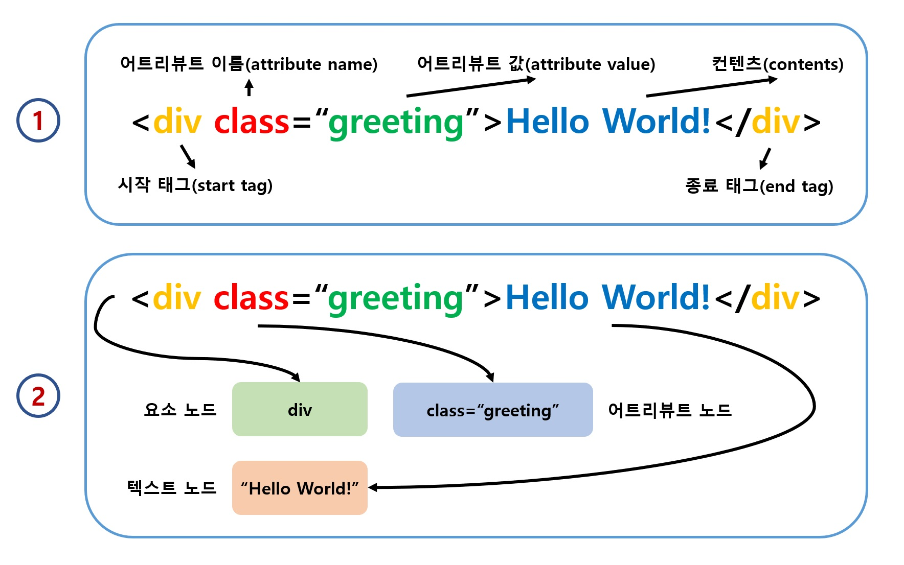
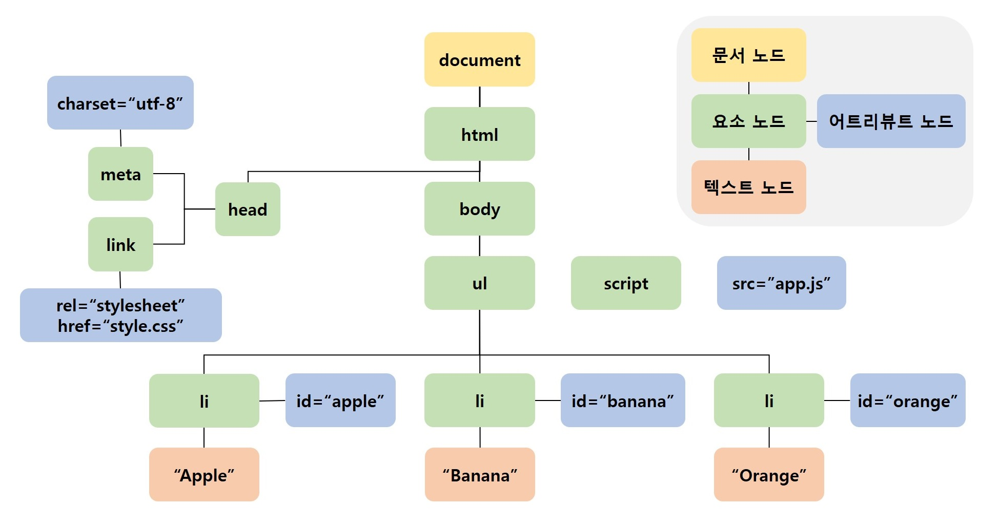
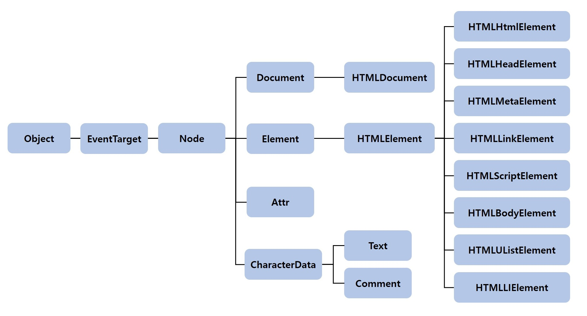

DOM(Document Object Model)은 HTML 문서의 계층적 구조와 정보를 표현하고 이를 제어할 수 있는 API인 프로퍼티와 메서드를 제공하는 트리 구조입니다. 지금부터 DOM에 대해 알아봅시다!

## 노드
### HTML 요소와 노드 객체
> HTML 요소(Element)는 HTML 문서를 구성하는 개별적인 요소입니다.

HTML 요소는 렌더링 엔진에 의해 파싱되고 DOM을 구성하는 요소 노드 객체로 변환됩니다. 이때 HTML 요소의 어트리뷰트(Attribute)는 어트리뷰트 노드(Attribute Node)로 HTML 요소의 텍스트 컨텐츠(Text Contents)는 텍스트 노드(Text Node)로 변환됩니다.

<br>

<div align='center'>



</div>

<br>

HTML 문서는 HTML 요소의 집합입니다. 따라서 HTML 요소의 컨텐츠 영역에 텍스트 뿐만 아니라 다른 HTML 요소를 포함하는 중첩 관계를 갖습니다. 이때 HTML 요소 간에는 중첩 관계에 의한 계층적 부모-자식(Parent-Child) 관계가 형성됩니다.

이러한 특성을 반영해 HTML 요소를 객체화한 모든 노드 객체들을 트리 자료로 구성할 수 있죠.

<br>

### 노드 객체의 타입

다음 HTML 문서를 렌더링 엔진이 파싱한다고 생각해봅시다.

```html
<!DOCTYPE html>
<html>
  <head>
    <meta charset="UTF-8">
    <link rel="stylesheet" href="style.css">
  </head>
  <body>
    <ul>
      <li id="apple">Apple</li>
      <li id="banana">Banana</li>
      <li id="orange">Orange</li>
    </ul>
    <script src="app.js"></script>
  </body>
</html>
```

렌더링 엔진은 이렇게 DOM으로 생성합니다.

<br>

<div align='center'>



</div>

<br>

> HTML 요소 사이의 **개행**과 **공백**은 **공백 텍스트 노드**가 되는데, 위 그림에서는 생략되었습니다.

이렇게 DOM은 노드 객체의 계층적인 구조로 구성됩니다. 노드 객체는 종류(12개)도 있으며 상송 구조도 갖습니다. 중요한 노드 구조(타입)은 4개인데, 아래와 같습니다.

- 문서 노드(Document Node)
  - DOM 트리의 최상위에 존재하는 루트 노드로서 document 객체를 가리킵니다. 
  - document 객체는 브라우저가 렌더링한 HTML 문서 전체를 가리키는 객체로서 전역 객체 window의 document 프로퍼티에 바인딩되어 있습니다.
  - HTML 문서당 document 객체는 유일합니다.
  - DOM 트리의 노드들에 접근하기 위한 진입전(Entry Point)입니다.
- 요소 노드(Element Node)
  - HTML 요소를 가리키는 객체입니다.
  - HTML 요소 간 중첩에 의한 부모-자식 관계를 가지고 이를 통해 정보를 구조화합니다.
  - 즉 문서의 구조를 표현하는 노드입니다.
- 어트리뷰트 노드(Attribute Node)
  - HTML 요소의 어트리뷰트를 가리키는 객체입니다.
  - 어트리뷰트 노드는 어트리뷰트가 지정된 HTML 요소의 요소 노드와 연결되어 있습니다.
  - 어트리뷰트 노드에 접근하려면 먼저 요소 노드에 접근해야 합니다.
- 텍스트 노드(Text Node)
  - HTML 요소의 텍스트를 가리키는 객체입니다.
  - 텍스트 노드는 DOM 트리의 종점입니다.
  - 텍스트 노드에 접근하려면 먼저 요소 노드에 접근해야 합니다.

<br>

### 노드 객체의 상속 구조
> DOM을 구성하는 노드 객체는 자신의 구조와 정보를 제어할 수 있는 DOM API를 사용할 수 있습니다.

노드 객체는 자신의 부모, 형제, 자식을 탐색하고 자신의 어트리뷰트와 텍스트를 조작할 수 있습니다.

DOM을 구성하는 노드 객체는 브라우저 환경에서 제공하는 호스트 객체(Host Objects)입니다. 그러나 노드 객체 또한 자바스크립트 객체로 프로토타입에 의한 상속 구조를 갖죠.

<br>

<div align='center'>



</div>

<br>

위와 같이 Object, EventTarget, Node 인터페이스를 상속 받죠. 이를 프로토타입 체인 관점에서 생각해보면 요소 노드 객체는 프로토타입 체인에 있는 모든 프로토타입의 프로퍼티와 메서드를 상속받아 사용할 수 있는 것입니다.

결국 DOM은 HTML 문서의 계층적 구조와 정보를 표현하는 것은 물론, 노드 객체의 종류와 노드 타입에 따라 필요한 기능을 프로퍼티와 메서드의 집합인 DOM API로 제공합니다. 이 DOM API를 통해 HTML 구조나 내용 또는 스타일 등을 동적으로 조작할 수 있죠.

<hr>
<br>