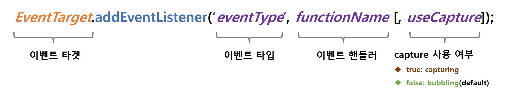

브라우저는 처리해야 할 사건이 발생하면 이를 감지해서 이벤트를 발생 시킵니다. 이러한 이벤트와 대응하는 함수를 통해 프로그래밍을 제어할 수 있죠. 이벤트에 대해 자세히 알아봅시다.

<br>

## 이벤트 드리븐 프로그래밍
> 이벤트가 발생했을 때 호출되는 함수를 이벤트 핸들러(Event Handler), 이벤트 발생 시 브라우저에 이벤트 핸들러 호출을 위임하는 것을 이벤트 **핸들러 등록**이라고 합니다.

사용자가 버튼을 클릭했을 때 특정 함수를 호출하고 싶다 가정해볼까요? 문제는 `언제 호출이 되는가`입니다. 사용자가 언제 버튼을 클릭할 수 없으니까요. 다행히 브라우저는 사용자의 버튼 클릭을 **감지**할 수 있으며, 클릭 이벤트를 **발생**시킬 수도 있죠. 클릭 이벤트가 발생하면 특정 함수(이벤트 핸들러)를 호출하도록 브라우저에게 **위임**할 수도 있습니다.

이렇게 이벤트와 이벤트 핸들러를 통해 사용자와 애플리케이션은 **상호작용(Interfaction)** 할 수 있는데, 결국 프로그램의 흐름이 이벤트 중심으로 제어됩니다. 이러한 프로그래밍 방식을 `이벤트 드리븐 프로그래밍(Event-driven Programming)`이라 합니다.

<br>

## 이벤트 타입
> 이벤트 타입(Event Type)은 이벤트 종류를 나타내는 문자열입니다.

이벤트 타입은 약 200여 가지가 있는데, 상세 목록은 [여기](https://developer.mozilla.org/ko/docs/Web/Events)에서 확인해주세요. 큰 맥락의 이벤트 종류는 아래와 같습니다.
- 마우스(Mouse) 이벤트
- 키보드(Keyboard) 이벤트
- 포커스(Focus) 이벤트
- 폼(Form) 이벤트
- 값 변경(Change Value) 이벤트
- DOM 뮤테이션(Mutation) 이벤트
- 뷰(View) 이벤트
- 리소스(Resources) 이벤트

<br>

## 이벤트 핸들러 등록
> 이벤트 핸들러(Event Handler 또는 Event Listener)는 이벤트가 발생했을 때 브라우저에 호출을 위임한 함수입니다.

이벤트가 발생하면 브라우저에 의해 호출될 함수가 이벤트 핸들러이며, 이를 등록하는 방법은 3가지가 있습니다.

<br>

### 이벤트 핸들러 어트리뷰트
> 이벤트 핸들러 어트리뷰트 값으로 함수 호출문 등의 문(Statement)을 할당하면 이벤트 핸들러가 등록됩니다.

HTML 요소 중에는 이벤트에 대응하는 이벤트 핸들러 어트리뷰트가 있는데, on 접두사와 이벤트의 종류를 나타내는 이벤트 타입으로 이루어져 있습니다. `onclick`, `onchange`, `onfocus`처럼 말이죠. 이벤트 등록 방법은 아래와 같습니다.
```html
<!DOCTYPE html>
<html lang="en">

<head>
  <meta charset="UTF-8">
  <meta http-equiv="X-UA-Compatible" content="IE=edge">
  <meta name="viewport" content="width=device-width, initial-scale=1.0">
  <title>Document</title>
</head>

<body>
  <button onclick="displayAlert('Hi!')">Click to Hi</button>
  <script>
    function displayAlert(greeting) {
      return alert(greeting);
    }
  </script>
</body>

</html>
```
- 함수 참조가 아닌 함수 호출문 등의 **문**을 할당합니다.
- 콜백 함수와 마찬가지로 함수 참조를 등록해야 브라우저가 이벤트 핸들러를 호출할 수 있습니다.
- 만약 함수 호출문을 등록하면 그 평가 결과가 이벤트 핸들러로 등록되므로, 고차 함수 호출문이라면 문제가 없지만 함수가 아닌 값을 반환하는 함수 호출문의 경우 브라우저가 이벤트 핸들러를 호출할 수 없습니다.
- **이벤트 핸들러 어트리뷰트 값은 암묵적으로 생성될 이벤트 핸들러의 함수 몸체를 의미**합니다.
  ```js
  // onclick="displayAlert('Hi!')" 어트리뷰트는
  // 자바스크립트 엔진에 의해 파싱되어 암묵적으로 함수를 생성합니다.
  function onclick(event){
    displayAlert('Hi');
  }
  // 그 후 onclick 이벤트 핸들러 프로퍼티에 할당합니다.
  ```

이처럼 동작하는 이유는 이벤트 핸들러에 인수를 전달하기 위해서입니다. 함수 참조를 할당한다면 이벤트 핸들러에 인수를 전달하기 곤란해지거든요.
```html
// 너무 곤란해요.
<button onclick="displayAlert">
  Click to Hi
</button>
```

따라서 이벤트 핸들러 어트리뷰트 값으로 여러 문을 할당할 수 있습니다.
```html
<button onclick="console.log('Hi'); alert('Hi!');">
  Click to Hi
</button>
```

기본적으로 HTML과 자바스크립트는 관심사가 다르므로 분리하는 것이 좋습니다. 그러나 모던 자바스크립트의 CBD(Component Based Development)의 경우 HTML, CSS, 자바스크립트를 관심사가 분리되어있지 않고 View를 구성하는 요소로 판단하므로 혼재하여 사용합니다.
```html
<!-- Angular.js -->
<button (click)="handleClick($event)">
  Click
</button>
<!-- React.js -->
<button onClick={handleClick}>
  Click
</button>
<!-- Vue.js -->
<button on:click={handleClick}>
  Click
</button>
<!-- Svelte.js -->
<button v-on:click="handleClick($event)">
  Click
</button>
```

<br>

### 이벤트 핸들러 프로퍼티
> window 객체, Document와 HTMLElement 타입의 DOM Node 객체는 이벤트에 대응하는 이벤트 핸들러 프로퍼티를 가지며, 함수를 등록하면 해당 이벤트 핸들러 프로퍼티에 바인딩됩니다.

이벤트 핸들러 프로퍼티 키는 이벤트 핸들러 어트리뷰트와 마찬가지로 on 접두사와 이벤트 종류를 나타내는 이벤트 타입으로 이루어져 있습니다.
```html
<!DOCTYPE html>
<html lang="en">
  
  <head>
    <meta charset="UTF-8">
  <meta http-equiv="X-UA-Compatible" content="IE=edge">
  <meta name="viewport" content="width=device-width, initial-scale=1.0">
  <title>Document</title>
</head>

<body>
  <button>Click</button>
  <script>
    const $button = document.querySelector('button');
    $button.onclick = function () {
      console.log('button click');
    }
  </script>
</body>

</html>
```

이벤트 핸들러를 등록하기 위해 이벤트를 발생시킬 객체인 이벤트 타겟(Event Target)과 이벤트 종류를 나타내는 문자열인 이벤트 타입(Event Type)이 필요합니다. 위의 경우 이벤트 타겟은 **버튼 요소**, 이벤트 타입은 **'click'**, 이벤트 핸들러는 **익명 함수**입니다.

대부분 이벤트를 발생시킬 이벤트 타겟에 바인딩하여 이벤트 핸들러를 등록하지만, 반드시 그런 것은 아닙니다. 이벤트 핸들러는 `이벤트 타겟 또는 전파된 이벤트를 캐치할 DOM 노드 객체에 바인딩` 되기 때문이죠.

이벤트 핸들러 어트리뷰트도 결국 DOM Node 객체의 이벤트 핸들러 프로퍼티로 변환되기 때문에 결과적으로는 동일하게 등록하는 방식이나, 가장 큰 차이점은 `HTML과 자바스크립트의 분리`입니다. 그런데, 큰 문제가 있습니다. 객체의 프로퍼티는 중첩되지 않으므로 이벤트 핸들러 프로퍼티는 단 하나만 등록할 수 있는 것이죠. 이를 해결하기 위해 DOM 표준에 추가된 메서드가 있습니다.

<br>

### `addEventListener` 메서드
> DOM Level 2에 도입되었으며 `EventTarget.prototype.addEventListener` 메서드를 사용해 이벤트 핸들러를 등록할 수 있습니다.

<br>

<div align='center'>



</div>

<br>

- 첫 번째 매개변수는 문자열인 이벤트 타입을 전달하는데 이벤트 핸들러 프로퍼티 방식과 달리 on 접두사를 붙이지 않습니다.
- 두 번째 매개변수에는 이벤트 핸들러를 전달합니다.
- 세 번째 매개변수로는 이벤트 전파 단계(캡처링 또는 버블링)를 지정할 수 있습니다.

```html
<!DOCTYPE html>
<html lang="en">
  
  <head>
    <meta charset="UTF-8">
  <meta http-equiv="X-UA-Compatible" content="IE=edge">
  <meta name="viewport" content="width=device-width, initial-scale=1.0">
  <title>Document</title>
</head>

<body>
  <button>Click</button>
  <script>
    const $button = document.querySelector('button');
    $button.addEventListener('click', function () {
      console.log('button click');
    });
  </script>
</body>

</html>
```
- addEventListener 메서드 방식은 이벤트 핸들러 프로퍼티에 바인딩된 이벤트 핸들러에 아무런 영향을 주지 않습니다.
  - 이벤트 핸들러 프로퍼티에 이벤트 핸들러를 바인딩하지 않고 이벤트 핸들러를 `인수로 전달`하기 때문이죠.
- addEventListener 메서드는 하나 이상의 이벤트를 등록할 수 있으며, 이벤트 핸들러는 등록된 순서대로 호출됩니다.
  - 단, 참조가 동일한 이벤트 핸들러를 중복 등록하면 하나의 이벤트 핸들러만 등록됩니다.
      ```html
      <script>
        const $button = document.querySelector('button');

        const handleClick = function () {
          console.log('button click');
        }
        // 하나만 등록됩니다.
        $button.addEventListener('click', handleClick);
        $button.addEventListener('click', handleClick);
      </script>
      ```

<br>