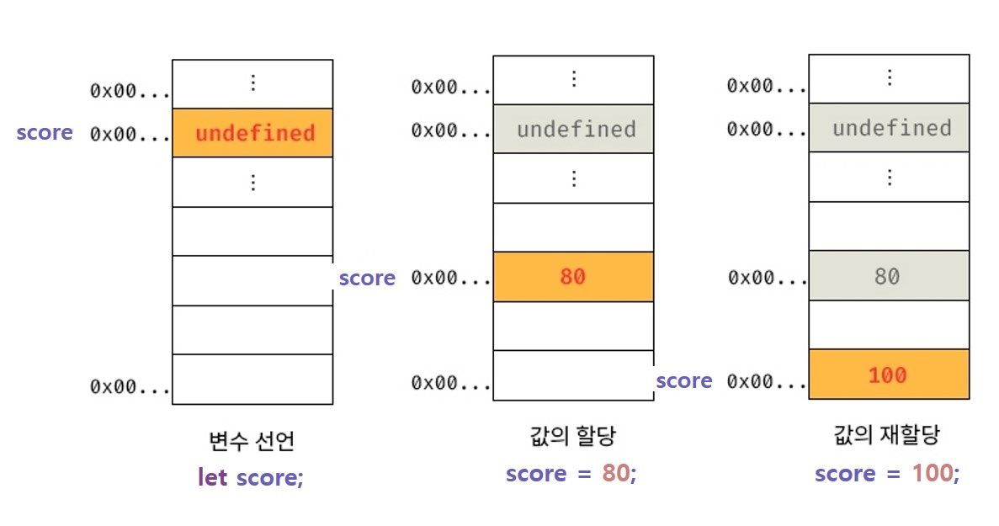
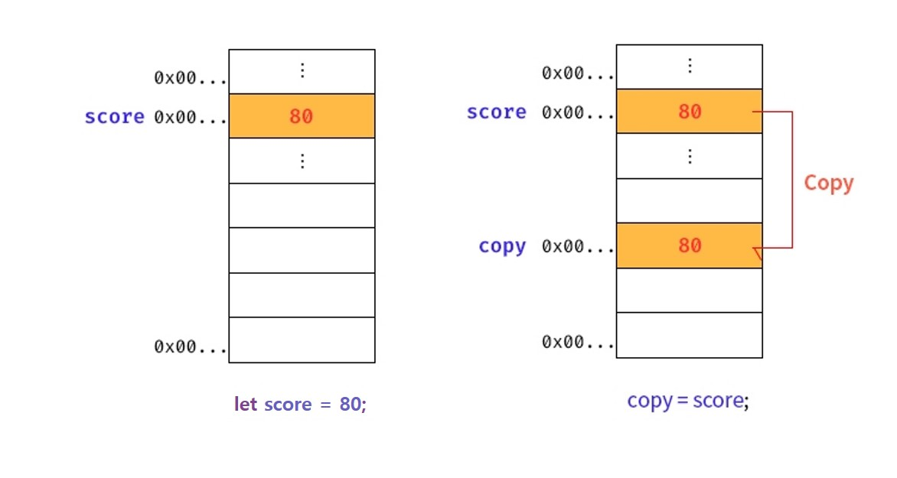
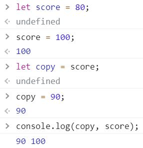
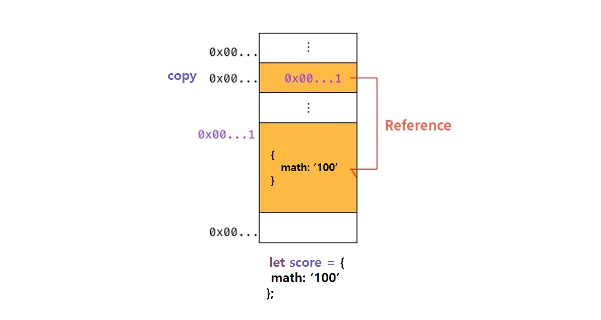
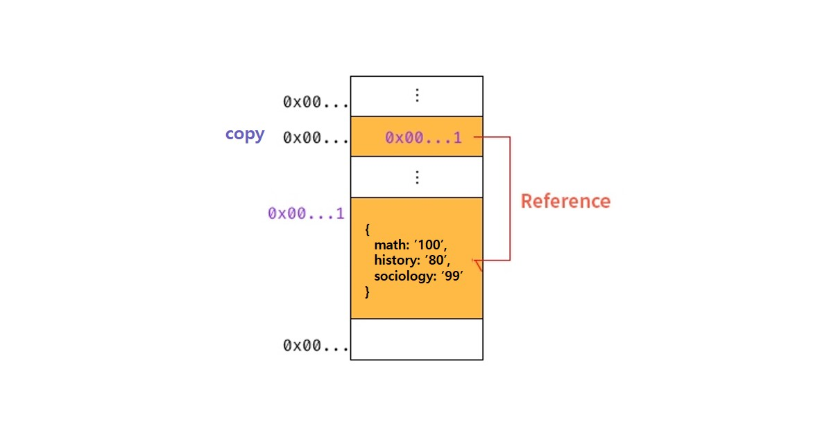
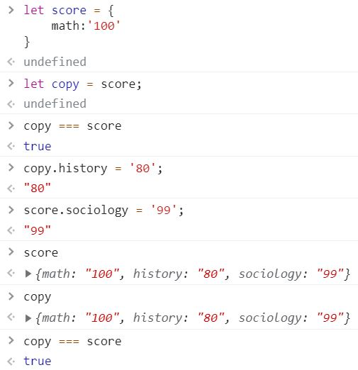

프로그래밍에서 데이터 타입은 매우 중요한 요소입니다. 그런데, 왜일까요? 어차피 데이터는 컴퓨터 메모리에 2진수로 저장될 텐데요, 왜 타입을 구분해서 정의했을까요?

## 데이터 타입(Data Type)
> 값의 종류로서 메모리의 공간을 효율적으로 사용하기 위해 필요합니다.

### 분류
데이터 타입은 크게 원시(Primitive) 타입과 객체(또는 참조, Object/Reference) 타입으로 분류합니다.
1. `Number, String, Boolean, undefined, null, Symbol은 원시 타입`입니다. `그 외는 객체 타입`입니다.
2. 원시 타입은 변경 불가능한 값(Immutable Value)입니다.
3. 참조 타입은 변경 가능한 값(Mutable Value)입니다.

글로만 보면 이해하기 힘들거에요. 그림과 함께 봅시다.

<br>

#### 원시 타입(Primitiv Type) : 변경 불가능한 값(Immutable Value)
> 기존에 할당된 값을 직접 변경하는 것이 아니라 새로운 원시 값을 생성합니다.

<div align="center">



<p>변수 score의 값 할당과 재할당에 대한 메모리 주소</p>

</div>

<br>

<div align="center">



<p>원시 값을 복사할 때의 메모리 상태</p>

</div>

<br>

<div align="center">



<p>원시 값이 변경될 때의 논리</p>

</div>

<br>

#### 객체 타입(Object Type) : 변경 가능한 값(Mutable Value)
> 기존에 할당된 값을 직접 변경할 수 있습니다.

<div align="center">



<p>변수 score의 값 할당과 재할당에 대한 메모리 주소</p>

</div>

<br>

<div align="center">



<p>변수 score의 값 할당과 재할당에 대한 메모리 주소</p>

</div>

<br>

<div align="center">



<p>변수 score의 값 할당과 재할당에 대한 메모리 주소</p>

</div>

<br>

숫자 `1`과 문자열 `'1'`은 비슷해 보이지만 다릅니다. 용도(연산, 화면에 출력 등) 뿐만 아니라 각 타입별 확보할 메모리 공간의 크기와 2진수 값도 다르고 심지어 해석조차 틀립니다.

<br>

### 필요성
만약 같다면 어떻게 될까요? 타입은 의미가 없어지고 연산, 출력 등 프로그래밍 언어로써의 기능을 성실히 수행할 수 있을까요? 개발자가 불러오려는 값이 생각과 다르게 제어된다면 기초적인 애플레케이션을 작성할 수도 없을 것입니다. 예를 들어 1 + 3 연산을 진행했는데 13이 될 수도 있고, 4가 될 수도 있습니다. 이런 기초적인 연산조차 혼동이 올 수 있어요.

우선, 자바스크립트 엔진은 데이터 타입, 즉 값의 종류에 따라 정해진 메모리 공간을 확보합니다. 그 말은 변수에 할당되는 데이터 타입에 따라 메모리 공간이 상이하다는 것입니다.

왜 데이터 타입별로 메모리 공간이 다르게 할당될까요? 언급했듯, 컴퓨터의 메모리에는 모든 데이터가 2진수로 저장됩니다. 아래를 볼까요?

```js
// 실제 메모리에 저장되는 값 : 0100 0001
// 숫자형으로는 65, 문자열로는 'A'
let a = 'A';

// 아래의 결과는?
console.log(a);
let b = a + 15;
// 아래의 결과는?
console.log(b);
```

문자열 'A'는 char형으로 0100 0001 비트(메모리에 저장되는 2진수는 비트를 나열한 것과 같아요!)입니다. 이는 숫자로 해석하면 65입니다. 그렇다면 `console.log(b)`의 결과는 80일까요? 
  - 예상치 못한 `A15`라는 값이 나오게 됩니다. 이는 자바스크립트의 동적 타입 언어적 특성 때문인데요, 이 부분은 넘어가도록 하겠습니다(후술합니다).

자바스크립트 엔진은 메모리에서 값을 읽어올 때 데이터 타입을 추론(Type Inference)하여 표현합니다. 즉, 숫자 65가 아니라 문자열 'A'로 이해하는 것입니다. 여기서 데이터 타입의 필요성을 생각해볼 수 있습니다.

1. 메모리 공간의 크기를 결정 : 데이터 타입에 따라 값을 저장할 때 필요한 공간이 달라진다.
2. 2진수를 해석하는 방법을 결정 : 데이터 타입에 따라 메모리에서 읽어온 값을 해석하는 방법이 달라진다.

<br>

### 동적 타입과 정적 타입?
생소한 단어가 나왔습니다. 그 전에, 한 번 생각해봅시다. 자바스크립트에서 변수를 선언할 때, 우리는 타입을 `정해줄까요?`

C, Java 등은 `int a = 0` 형태로 변수를 선언합니다. 즉 초기화-할당을 할 변수의 타입을 지정해주는 형태죠. 그런데 JavaScript, Python은 어떤가요? 타입을 `지정하지 않습니다`.

우리는 C와 Java처럼 변수에 할당할 수 있는 타입을 지정해야만 하는 언어를 **정적 타입 언어(static/strong type)** 라고 묶어 지칭하며, 이를 `명시적 타입 선언(explicit type declaration)`이라고 합니다.

반대로 JavaScript와 Python처럼 변수를 선언할 때 타입을 선언하지 않는 언어를 **동적 타입 언어(dynamic/weak type)** 라고 묶어 지칭하며, 이를 `암시적 타입 선언(implicit type declaration)`이라고 부릅니다.

그럼 특징을 살펴볼까요?

- 정적 타입 언어
  - 변수의 타입을 변경할 수 없어 `선언한 타입에 맞는 값만 할당`할 수 있습니다.
    ```java
    // 자바
    int a = 0;
    a = 'A';  // Compile Error
    ```
  - 대부분의 정적 타입 언어는 `컴파일 언어(Compile Language)`로써 컴파일 시점에 `타입을 체크`합니다.
    - 타입 체크(Type Check) : 선언한 데이터 타입에 맞는 값을 할당했는지 검사
  - 위의 절차로 타입의 일관성을 강제하여 안정적인 코드를 구현하고, 런타임(실행)에 발생하는 에러를 줄입니다.

- 동적 타입 언어
  - 미리 선언한 데이터 타입의 값이 아니라, 어떤 타입이라도 자유롭게 할당할 수 있습니다.
    ```js
    // 자바스크립트
    let a = 0;
    a = 'A';  // Not Problem
    ```
    ```py
    # 파이썬
    a = 0
    a = 'A'
    ```
  - 위의 절차로, `선언이 아닌 할당에 의해 타입이 결정(타입 추론)`되며 타입의 변환에 매우 자유롭습니다.
  - 단, 타입의 일관성을 강제하지 않으므로 코드 구현과 런타임 간 에러가 발생할 수 있습니다.
    - 이런 여러 문제점을 해결하고자 자바스크립트 진영에서는 타입스크립트(TypeScript)라는 새로운 언어(자바스크립트 기반)가 탄생했습니다.
  - 이와 별개로, 자바스크립트는 개발자의 의도와 상관 없이 엔진에 의해 **암묵적으로 타입이 자동 변환** 되기도 합니다. 아래는 위에서 언급했던 코드입니다.
    ```js
    let a = 'A';
    let b = a + 15;
    console.log(b);
    ```
    - 엔진은 a와 연산하는 `15를 문자열로 변환하여` 문자열 덧셈을 시행합니다. 이처럼 **문자열 타입 변수라고 예측했으나 실은 숫자 타입이었다** 는 문제가 발생합니다. 
  - 즉 동적 타입 언어는 **유연성(flexibility)은 높지만 신뢰성(reliability)은 떨어집니다**.

이대로 끝내기에는 조금 아쉬우니, 타입별로 간략하게 짚고 넘어가보죠.

<br>

### 데이터 타입 : Number
> 자바스크립트는 int, long, float, double 등 다양한 숫자 타입이 `존재하지 않습니다`.

ECMAScript 사양에서는 숫자 타입의 값을 [배정밀도 64비트 부동소수점 형식](https://ko.wikipedia.org/wiki/IEEE_754)을 따라 실수로 처리합니다.

- 예제 코드
  ```js
  // 모두 숫자 타입
  const int = 1;
  const db = 1.12;
  const ng = -1;

  // 표기법은 다르지만 모두 같은 값
  const binary = 0b01000001;  // 2진수
  const octal = 0o101;        // 8진수
  const hex = 0x41;           // 16진수

  console.log(binary);        // 65
  console.log(octal);         // 65
  console.log(hex);           // 65

  // 숫자 타입은 모두 실수로 처리
  console.log(1 === 1.0);     // true

  // 특별한 숫자 값도 존재
  const INF = Infinity;       // 양의 무한대
  console.log(-INF);          // 음의 무한대
  console.log(INF * 'a')      // NaN(not a number, 연산 불가)
  ```

<br>

### 데이터 타입 : String
> 0개 이상 16비트 유니코드 문자(UTF-16)의 집합으로 전 세계 대부분의 문자를 표현할 수 있습니다.

작은 따옴표('), 큰 따옴표("), 백틱(`)을 통해 표기할 수 있습니다.
  - 백틱을 통해 템플릿 리터럴을 사용할 수 있으며, 자유롭게 JavaScript의 변수를 가져다 사용할 수 있습니다.

이스케이프 시퀀스(escape sequence)를 알아두면 다양한 표현을 할 수 있지만, 다루지 않습니다. 자세한 내용은 [여기](https://ko.wikipedia.org/wiki/%EC%9D%B4%EC%8A%A4%EC%BC%80%EC%9D%B4%ED%94%84_%EC%8B%9C%ED%80%80%EC%8A%A4)를 참조하세요.
  - 이 중 언급하고 넘어가야 하는 부분은 CR(carriage Return, `\r`)과 LF(Line Feed, `\n`)입니다.
  - CRLF는 Window 체계의 개행 방식입니다.
  - LF는 Unix 체계의 개행 방식입니다.
  - 자바스크립트는 두 개행방식을 지원하지만, LF를 권장합니다.

<br>

### 데이터 타입 : Boolean
> 논리적 참과 거짓을 나타냅니다.

<br>

### 데이터 타입 : undefined
> 개발자가 의도적으로 할당하기 위한 값이 아니라 자바스크립트 엔진이 변수를 초기화할 때 사용하는 값입니다.

undefined 값은 유일합니다.

<br>

### 데이터 타입 : null
> 변수에 null을 할당함은 이전에 참조하던 값을 더 이상 참조하지 않는다는, 값에 대한 참조를 명시적으로 제거하는 의미입니다.

null 값은 유일합니다.

<br>

### 데이터 타입 : Symbol
> ES6에서 추가됐으며 변경 불가능한 원시 타입의 값으로 중복되지 않는 유일무이한 값입니다.

<br>

### 데이터 타입 : Object
차후 깊게 다룹니다. 여기서는 자바스크립트가 **객체 기반의 언어** 이며 **자바스크립트의 거의 모든 것이 객체** 라고 알아두세요.

<hr>
<br>
<hr>

이번 장에서 타입 변환에 대해 자세히 다룹니다. 종류와 그 내용까지 말이죠.

## 타입 변환(Type Conversion)
> 자바스크립트의 모든 값은 타입이 존재하며, 이를 변환하는 방법에는 개발자에 의해 변환되는 방법과 개발자의 의도와 상관 없이 변환되는 방법이 있습니다.

- 타입 캐스팅(Type Casting, 또는 명시적 타입 변환(Explicit Coercion)) : 개발자가 의도적으로 값의 타입을 바꾸는 방법입니다.
  ```js
  let a = 10;
  let b = a.toString();     // 여기서 타입 캐스팅이 일어납니다.
  console.log(typeof b, b); // 'string', '10'
  console.log(typeof a, a); // 'number', 10
  ```

- 타입 강제 변환(Type Coercion, 또는 암묵적 타입 변환(Implicit Coercion)) : 자바스크립트 엔진에 의해 암묵적으로 타입이 자동 변환되는 방법입니다.
  ```js
  let a = 10;
  let b = a + '';
  console.log(typeof b, b); // 'string', '10'
  console.log(typeof a, a); // 'number', 10
  ```

<br>