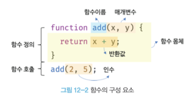
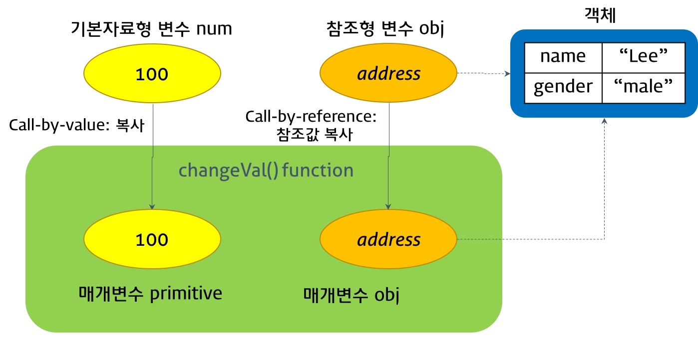

자바스크립트의 함수(function)는 매우 특별한 존재입니다. 자세히 알아봅시다!

## 함수(Function)
> 함수는 이름과 매개변수를 갖고, 필요한 때에 호출하여 코드 블록에 작성한 문들을 일괄적으로 실행할 수 있습니다.

즉, 특정 작업을 수행하기 위해 필요한 문(statement)의 집합을 정의한 코드 블록이 함수입니다. 이 함수는 아래와 같은 기능을 할 수 있습니다.
1. 반복적으로 작성되는 코드를 함수로 정의하여 `재사용`
   - 함수의 아이덴티티는 **재사용성**에 있습니다.
2. 객체 생성
3. 객체의 행위 정의(메서드로 동작)
4. 정보 은닉
5. 클로저
6. 모듈화

기능을 보면 이상하죠? 마치 함수가 객체처럼 쓰일 수 있는 것 같아요. 놀랍게도 자바스크립트의 함수는 호출할 수 있는 `객체(First-Class Object)`로서 [일급 객체](https://ko.wikipedia.org/wiki/%EC%9D%BC%EA%B8%89_%EA%B0%9D%EC%B2%B4)라고 불립니다. 변수나 객체, 배열의 프로퍼티(메서드)로 정의할 수 있고, 다른 함수에 전달하는 인수로도 사용할 수 있으며, 다른 함수의 반환값이 될 수도 있습니다.

그런데, 일급 객체가 뭐죠?

### 일급 객체
> 함수는 일반 객체가 아니라 **일급 객체(First-Class Object)** 로 취급됩니다.

- 아래와 같은 조건을 만족하면 일급 객체라고 해요.
  1. 무명 리터럴로 생성(런타임에 생성이 가능하다는 이야기에요)할 수 있습니다.
  2. 변수, 각종 자료구조(Object, Array, Set, Map 등)에 저장할 수 있습니다.
  3. 함수의 매개변수(Parameter)로 전달할 수 있습니다.
  4. 함수의 반환(return) 값으로 사용할 수 있습니다.
- 예제 코드를 보면 더 정확히 알겠죠?
  ```js
  // 1번, 2번 조건에 충족됩니다.
  const increase = function (num) {
    return ++num;
  }
  console.log(increase);                // ƒ (num) { return ++num; }
  console.log(increase(3));             // 4


  // 3번 조건에 충족됩니다.
  const predicates = { increase };
  console.log(predicates);              // {increase: ƒ}
  console.log(predicates.increase(3));  // 4

  // 3번, 4번 조건에 충족됩니다.
  function makeCounter(predicates) {
    let num = 0;

    return function() {
      num = predicates(num);
      return num;
    };
  }

  const increaser = makeCounter(predicates.increase);
  console.log(increaser());             // 1
  console.log(increaser());             // 2
  ```

`함수는 일급 객체`라는 것은 함수를 객체와 동일하게 사용할 수 있다는 의미입니다. 즉, 함수는 값을 가용할 수 있는 곳이라면 리터럴로 정의할 수 있고 런타임에 함수 객체로 평가되는 것이죠.

함수 객체와 일반 객체는 아래와 같은 차이가 있습니다.
1. 소괄호(`()`)를 사용한 **호출**인데, 일반 객체는 호출이 불가능하지만 함수 객체는 호출할 수 있습니다.
2. 함수 객체에는 일반 객체에 없는 함수 고유 프로퍼티가 존재합니다.

함수도 일반 객체처럼 프로퍼티를 소유할 수 있습니다. 즉, Object.getOwnPropertyDescriptors를 사용할 수 있죠. 함수 객체가 소유한 프로퍼티를 살펴볼까요?

> TODO : callee 프로퍼티 누락되었음 2021-10-01

- **arguments** 프로퍼티
  - arguments 객체는 함수 호출 시 전달된 인수(argument)들의 정보를 담고 있는 순회 가능(Iterable)한 유사 배열 객체입니다.
  - 함수 내부에서 지역 변수처럼 사용되며 외부에서는 참조할 수 없습니다.
  - ES3부터 표준에서 폐지되어 사용이 권장되지 않습니다.
  - 자바스크립트는 함수의 매개변수와 인수의 개수가 일치하는지 확인하지 않아 에러가 발생하지 않습니다.
    - 지정된 개수보다 적은 경우 : 매개변수는 undefined로 초기화됩니다.
    - 지정된 개수보다 많은 경우 : 암묵적으로 arguments 객체에 순서대로 저장(순회 가능한 유사 배열 객체이므로)됩니다.
    - 이러한 이유로 `가변 인자 함수`를 구현할 때 유용합니다.
  - 단, 유사 배열 객체는 배열이 아니므로 배열 메서드를 사용할 수 없으나 아래의 방법으로 간접 호출할 수 있습니다.
    1. `Function.prototype.call, Function.prototype.apply` 사용하기. [참조1](https://github.com/FECrash/JavascriptCrash/blob/main/Javascript/this.md#functionprototypeapplycallbind-%EB%A9%94%EC%84%9C%EB%93%9C%EC%97%90-%EC%9D%98%ED%95%9C-%EA%B0%84%EC%A0%91-%ED%98%B8%EC%B6%9C)
      ```js
      function sum(){
        // const array = Array.prototype.slice.apply(arguments);
        const array = Array.prototype.slice.call(arguments);
        return array.reduce(function (pre, cur){
          return pre + cur;
        }, 0);
      }
      console.log(sum(1, 2, 3, 4, 5));  // 15
      ```
    2. ES6의 Rest 파라미터
      ```js
      function sum(...args){
        return args.reduce((pre, cur) => pre + cur, 0);
      }
      console.log(sum(1, 2, 3, 4, 5));  // 15
      ```

<br>

- **caller** 프로퍼티
  - 비표준 프로퍼티로 함수 자신을 호출한 함수를 가리킵니다.

<br>

- **length** 프로퍼티
  - 함수를 정의할 때 선언한 매개변수의 개수를 가리킵니다.
  - `arguments 객체의 length 프로퍼티`와 `함수 객체의 length 프로퍼티`의 값은 다를 수 있습니다.
    - 전자의 경우 인자(argument)의 개수, 후자의 경우 매개변수(parameter)의 개수를 가리키기 떄문이지요.

<br>

- **name** 프로퍼티
  - ES6에서 표준이 되었으며 함수 이름을 나타냅니다. ES5와 ES6의 동작이 서로 다릅니다.
  - 익명 함수 표현식의 경우 `ES5는 빈 문자열`을, `ES6는 함수 객체를 가리키는 식별자`를 값으로 갖습니다.

<br>

- **__proto__** 접근자 프로퍼티
  - `[[Prototype]]` 내부 슬롯이 가리키는 프로토타입 객체에 접근하기 위해 사용합니다.

<br>

- **prototype** 프로퍼티
  - 생성자 함수로 호출할 수 있는 객체로 constructor만이 소유합니다.
  - 일반 객체와 생성자 함수로 호출할 수 없는 non-constructor는 prototype 프로퍼티가 존재하지 않습니다.
    - 즉, 함수가 객체를 생성하는 생성자 함수로 호출될 때, 생성자 함수가 생성할 인스턴스의 프로토타입 객체를 가리키는 거죠.

`__proto__`와 `[[Prototype]]`에 대해서는 [프로토타입 페이지](https://github.com/FECrash/JavascriptCrash/blob/main/Javascript/prototype.md)를 참고해주세요.

<br>

### 함수 정의
> 함수를 정의하는 방식은 네 가지(ES6에서 추가되었습니다)로 분류할 수 있습니다.

1. 함수 선언문(Function Declaration) : `function` 키워드와 함수명, 매개변수 목록, 함수 몸체로 구성됩니다.
    ```js
    function sum(a, b){
      return a + b;
    }
    
    console.log(sum(1, 2)); // 3
    ```
    - 함수 선언문은 **함수명을 생략할 수 없습니다**.
    - 자바스크립트의 함수는 매개변수의 타입을 기술하지 않으며, 매개변수를 넘기지 않으면 undefined로 선언됩니다.
      ```js
      function sum(a, b){
        return a + b;
      }
      console.log(sum());   // NaN
      ```
    - 함수 몸체는 함수 호출 시 실행되는 문들의 집합닙니다. 중괄호(`{}`)로 감싸지며 `return` 문으로 함수 실행의 결과(`return value`)를 반환할 수 있습니다.

2. 함수 표현식(Function Expression) : 함수 리터럴 방식으로 함수를 정의하고 변수에 할당합니다. 종류가 두 가지 존재하는데, 예제로 살펴봅니다.
     - 기명 함수 표현식 : 함수명을 `지정하는` 방법입니다.
       ```js
       const foo = function sum(a, b){
         return a + b;
       }

       console.log(foo(1, 2)); // 3
       console.log(sum(1, 2)); // ReferenceError: multiply is not defined
       ```
       - 이처럼 변수에 할당할 수 있는 이유는 함수가 `일급 객체`로 평가되기 때문입니다. 해당 변수는 원시 값이 아니라 할당된 함수를 가리키는 참조값을 저장하며, 함수명이 아닌 변수명으로 함수를 호출할 수 있습니다.
       - **함수 호이스팅**과 연관된 항목이므로 아래에서 자세히 다룹니다.
     - 익명 함수 표현식 : 함수명을 `생략하는` 방법입니다.
       ```js
       // ES5의 함수 표현식
       const bar = function(a, b){
         return a + b;
       }

       const foo = bar;

       console.log(bar(1, 2)); // 3
       console.log(foo(1, 2)); // 3
       ```

3. Function 생성자 함수 : 사용하지 않습니다!
    ```js
    const sum = new Function('a', 'b', 'return a + b');
    
    console.log(sum); // 3
    ```
    - 그리고 현재 모던 브라우저에서는 아래와 같은 오류가 발생하네요! : `EvalError: Refused to evaluate a string as JavaScript because 'unsafe-eval' is not an allowed source of script in the following Content Security Policy directive: "script-src chrome://resources chrome://test 'self' 'unsafe-inline' https:".`


4. 화살표 함수 : ES6에 등장한 새로운 함수 선언 방식으로, function 키워드 대신 화살표(arrow, `=>`)를 사용해 더 간략하게 표기할 수 있습니다. 항상 `익명 함수`로 정의합니다.
    ```js
    // ES6의 화살표 함수 : 익명 함수로 작성합니다.
    const bar = (a, b) => {
      return a + b;
    }

    console.log(bar(1, 2));  // 3
    ```
    - 문법이 조금 달라짐을 제외하면 특이한 점이 없는데... 내부 동작이 많이 변경되었습니다. 자세한 것은 ES6의 함수에서 좀 더 자세히 다뤄보죠.

함수를 정의하는 방식이 네 가지나 됩니다. 그러나 반환하는 결과는 동일하네요? 대체 뭐가 다르길래 이렇게 나눠진 걸까요? 여기서 함수 호이스팅이 등장합니다.

<br>

### 함수 호이스팅(Function Hoisting)
> 자바스크립트는 모든 선언을 **호이스팅**합니다!

우선 예제를 봅시다!

```js
console.log(sum(1, 2)); // 3

function sum(a, b){
  return a + b;
}
```

오, 작동하네요? 그럼 저희는 이렇게 생각할 수 있습니다. *호이스팅이 발생하는구나!*

자바스크립트는 모든 선언문이 **선언되기 이전에 참조가 가능**합니다. 함수 선언문으로 정의된 함수가 평가되는 과정은 아래와 같습니다.
1. 자바스크립트 엔진이 스크립트가 로딩되는 **시점**에 초기화 합니다.
2. 초기화된 함수를 변수 객체(Variable Object, VO)에 저장합니다.

이렇게 함수의 선언, 초기화, 할당이 한 프로세스에서 이루어지는 것입니다! 그럼 당연히 함수 선언의 위치와 상관 없이 어느 곳에서든 호출이 가능하죠.

```js
const result = sum(1, 2);

console.log(sum(1, 2));  // ReferenceError: sum2 is not defined

const sum = function(a, b){
  return a + b;
}
```

그렇지만 함수 표현식은 함수 호이스팅이 아닌 **변수 호이스팅**이 발생합니다. 변수 호이스팅은 함수 호이스팅과 그 과정이 다릅니다. 아래를 볼까요?
1. 함수 표현식은 `런타임(Runtime)`에 해석되고 실행되므로 변수 생성과 초기화, 할당이 분리되어 진행됩니다.
2. 호이스팅된 변수는 undefined로 초기화됩니다.
3. 실제로 값의 할당은 `할당문`에서 이루어집니다!

함수 호이스팅은 함수 호출 전에 반드시 함수를 선언해야 된다는 규칙을 무시하기 때문에 코드의 구조적 결함이 발생할 수 있으므로 **함수 표현식**을 사용하도록 권장합니다.

<br>

### 함수 호출
> 함수를 가리키는 식별자와 함수 호출 연산자(`()`)로 호출합니다.

우리는 많은 함수를 호출해 왔습니다. 정확한 명칭을 몰라도 상당히 직관적으로 다가오는 형태이죠. 그림부터 볼까요?

<br>

<div align="center">



</div>

<br>


매개변수는 함수 몸체 내부에서 변수와 *동일하게* 취급됩니다. `매개변수(Parameters)`는 `인수(Arguments)`에 연결됩니다. 자바스크립트는 이를 처리하는 방식이 다른 언어와 달라요. 다른 언어에서는 매개변수와 인수가 1:1 대응 되거나, 필요한 인수를 넘겨주지 않으면 에러를 냅니다.

그에 반해 자바스크립트는 암묵적으로 매개변수가 생성되고, undefined로 초기화되어 함수 호출 시 입력한 인수의 순서대로 할당되는 형태입니다.

특징을 나열해보면 아래와 같아요.

1. 함수는 매개변수와 인수의 개수가 일치하는지 체크하지 않습니다.
  - 인수가 할당되지 않은 매개변수는 undefined가 됩니다!
    ```js
    function sum(a, b){
      console.log(a, b);      // 1, undefined
      return a + b;
    }

    console.log(sum(1));      // NaN
    ```
2. 인수가 매개변수보다 많은 경우 에러 없이 무시됩니다.
    ```js
    funtion sum(a, b){
      return a + b;
    }

    console.log(sum(1, 2, 3));  // 3
    ```
3. 오, 그렇다고 초과한 인수가 사라지는 것은 아닙니다. 특이하게도 arguments라는 객체에 프로퍼티로 보관되기 때문이죠.
    ```js
    function sum(a, b{
      console.log(arguments);
      // Arguments(3) [1, 2, 3, caljames: ƒ, Symbol(Symbol.iterator): ƒ]
    }

    sum(1, 2, 3);
    ```
    - arguments 객체는 `가변 인자 함수`를 구현할 때 유용합니다. 뒤에 자세히 다루니 안심하세요!
3. 자바스크립트는 매개변수 타입을 사전에 지정할 수 없습니다.
   - 그렇기에 필연적으로 적절한 인수가 전달되었는지 확인해야 합니다. 이를 무시하면 함수 호출에 대한 에러가 `런타임`에 발생하게 되니까요.
   - 기본적으로 `단축 평가`를 사용하여 기본값을 많이 할당했으나, ES6에서는 매개변수에 기본값을 지정할 수 있게 되었습니다.
4. 매개변수의 개수에는 **제한이 없습니다**. 말도 안되지만 객체 형태로 관리되니까요. 물론 매개변수의 개수는 최소한으로 해야하며, 최대로는 3개까지 권장하고 있습니다.
   - 만약 많은 매개변수를 넘겨야 하는 상황이라면, 객체 형태로 전달해보세요!
      ```js
      function sum(expr){
        return expr.a + expr.b + expr.c + expr.d + expr.e;
      }

      console.log(sum({a:1, b:2, c:3, d:4, e:5}));
      ```
      - 단, 객체를 인수로 사용하면 참조 값을 바라보게 되므로 **원본 객체에 변형이 가해지니** 주의해주세요.

오, 중요한 내용이 나왔네요. 매개변수로 객체를 넘기면 원본 객체에 변형이 가해진다구요? 이게 무슨 일이죠?

그래도 다행히, 우리는 원시 값과 객체가 어떻게 동작하고 메모리에 할당되는지 이해하고 있습니다. 그림과 예제를 보면서 이 함수 호출 상황을 자세히 생각해볼까요?

<br>

<div align="center">



<p>원시 값인 변수 <em>num</em>을 넘기면 매개변수는 <em>값</em>을 복사하므로 매개변수와 인수가 서로 <strong>다릅니다</strong>.</p>
<p>객체인 변수 <em>obj</em>를 넘기면 매개변수는 <em>참조 값</em>을 복사하므로 매개변수와 인수가 서로 <strong>같습니다</strong>.</p>

</div>

<br>

함수를 호출하면서 매개변수에 값을 전달하는 방식을 값에 의한 호출(Call by Value), 참조에 의한 호출(Call by Reference)이라고 합니다. 결국 동작은 `값`을 전달함에 있어 동일하지만요. 아래 예제를 봅시다.

```js
function changeVal(primitive, obj) {
  primitive += 100;
  obj.name = 'amy';
  obj.age = 16;
  console.log(primitive); // 200
}

const num = 100;
const obj = {
  name: 'james',
  age: 24
};

console.log(num);         // 100
console.log(obj);         // {name: 'james', age: 24}

changeVal(num, obj);

console.log(num);         // 100
console.log(obj);         // {name: 'amy', age: 16}
```

결국, `원시 값 num`은 **변경이 불가능**하므로 재할당을 통해 새로운 원시 값으로 교체했습니다. `객체 obj`는 **변경이 가능**하므로 재할당 없이 직접 값을 교체했죠. 여기서 중요한 것은 원시 값을 매개변수로 전달하면 원본의 값을 훼손하지 않아 부수 효과가 `일어나지 않고`, 객체는 `일어난다`는 것입니다. 당연히 원본 객체가 훼손되면 많은 문제가 생기겠죠? 이에 대한 해결책으로 객체를 **불변 객체(Immutable Object)** 로 만들거나, **깊은 복사(Deep Copy)** 하는 방법이 존재합니다.

이렇게 외부 상태를 변경하지 않고, 또 의존하지 않는 함수를 `순수 함수`라고 합니다. 자, 또 모르는 단어가 나왔군요? 기 죽지 말고 아래에서 살펴봅시다!

<br>

### 순수 함수, 비순수 함수
> 부수 효과(Side Effect)가 없는 함수를 순수 함수(Pure Function), 부수 효과가 있는 함수를 비순수 함수(Impure Function)라고 합니다.

바로 예제를 통해 순수 함수, 비순수 함수를 제대로 짚어봅시다.

- 순수 함수 : 순수 함수가 반환한 결과를 변수에 재할당하므로 추적이 쉽습니다.
  ```js
  let count = 0;

  // 순수 함수
  function increase(n) {
    // 외부 상태에 의존적이지 않고 외부 상태를 변경하지도 않는다.
    return ++n;
  }

  count = increase(count);
  console.log(count); // 1

  count = increase(count);
  console.log(count); // 2
  ```

- 비순수 함수 : 외부 상태(count)를 변경하니 상태 변화를 추적하기 힘들어요.
  ```js
  let count = 0;

  // 비순수 함수
  function increase() {
    // 외부 상태에 의존하며 외부 상태를 변경한다.
    return ++count;
  }

  increase();
  console.log(count); // 1

  increase();
  console.log(count); // 2
  ```

당연히, **얕은 복사**된 객체를 인수로 넘기면 외부 상태에 의존하게 됩니다. 그래서 비순수 함수가 되니, 위에서 언급한 해결책을 사용하여 순수 함수로 작성하기 바랍니다.

마지막으로, 순수 함수의 특징을 살펴볼까요?
1. 부수 효과를 최대한 억제하여 오류를 피한다.
2. 프로그램의 안정성을 높인다.

이런 프로그래밍 패러다임을 **함수형 프로그래밍**이라고 합니다.

<br>

### 반환문
> `return` 키워드와 표현식으로 반환문을 만들고 함수 외부로 반환할 수 있습니다.

자세하게 설명할 필요는 없지만, 짚고 넘어가야 하는 부분이 있습니다.

함수 호출은 **표현식**이라는 것을 기억하시나요? 함수 호출 표현식은 return 키워드가 반환한 반환 값으로 평가됩니다.

반환문(return 문)은 아래와 같은 역할을 합니다.
1. 함수의 실행을 중단하고 외부로 결과값을 반환합니다.
    ```js
    function sum(a, b){
      return a + b;

      console.log(a, b);    // 실행되지 않습니다.
    }

    sum(1, 2);              // 3인 함수 호출 표현식입니다.
    ```
2. 반환문을 지정하지 않거나 생략하면 undefined를 반환합니다.
    ```js
    function foo(){
      return;
    }

    function bar(){
    }

    console.log(foo());     // undefined
    console.log(bar());     // undefined
    ```
3. return 키워드를 사용할 때 줄바꿈(개행문자의 사용)을 한다면 ASI(세미콜론 자동 삽입 기능)에 의해 undefined가 반환됩니다.
    ```js
    function sum(a, b){
      return
        a + b;
    }
    /*
      // 실제 평가
      function sum(a, b){
        return;
          a + b;
      }
     */

    console.log(sum(1, 2)); // undefined
    ```
4. 반환문은 함수의 몸체에서만 사용할 수 있습니다. 나머지는 `SyntaxError: Illegal return statement` 에러가 발생합니다.
     - Node.js는 모듈 시스템으로 `파일 스코프`를 가집니다. 즉, return을 전역에서 사용해도 에러가 나지는 않아요.

<br>

### 함수의 종류
> 함수는 여러 형태가 존재합니다.

함수 정의 방식, 순수/비순수 함수도 배웠습니다. 그런데 또 무슨 종류가 있는 걸까요?

이는 함수의 `사용처`에 있습니다. 하나씩 살펴볼까요?

- 즉시 실행 함수(Immediately Invoked Function Expression, IIFE)
  - 함수 선언과 동시에 즉시 호출되는 함수로, 다시 호출할 수 없습니다.
  - 기명 함수로 작성해도 상관 없으나, 다시 사용할 수 없으므로 익명 함수로 작성하는 것이 일반적입니다.
  - 반드시 그룹 연산자(`()`)로 감싸야 합니다. 그 이유는 함수 선언문의 형식과 일치하지 않기 때문이며, ASI 기능 또한 에러를 발생시킵니다.
    ```js
    // SyntaxError: Function statements require a function name
    function (){
      // 기능 정의
    }();

    // SyntaxError: Unexpected token ')'
    function sum(){
      // 기능 정의
    }();
    ```
  - 즉시 실행 함수는 이렇게 작성할 수 있습니다.
    ```js
    // 1
    (function() {
      // 기능 정의
    }());

    // 2
    (function(){
      // 기능 정의
    })();

    // 3
    !function(){
      // 기능 정의
    }();

    // 4
    +function(){
      // 기능 정의
    }();
    ```
  - 일반 함수처럼 값을 반환할 수 있고, 인수를 전달할 수 있습니다.
    ```js
    // 값 반환
    const sum = (function(){
      return 10 + 100;
    }());

    console.log(sum); // 110

    const sub = (function(a, b){
      return a - b;
    }(10, 100));

    console.log(sub); // -90
    ```
  - 정리 : 즉시 실행 함수는 존재할 수 있는 변수와 함수의 충돌을 방지하는 곳에 자주 사용됩니다.

- 재귀 함수(Recursive Function) : 함수가 자기 자신을 호출하는 것은 재귀 호출(Recursive Call)이라고 합니다.
  - 재귀 함수는 자신을 **무한**으로 호출하므로 반드시 **탈출 조건**을 명시해야 합니다.
    ```js
    function factorial(num){
      if(num === 1) return 1;           // 탈출 조건
      return num * factorial(num - 1);  // 재귀 호출
    }

    const a = 5;

    factorial(a);                       // 재귀 함수 호출
    ```

- 내부 함수(Inner Function) : 중첩 함수(Nested Funtion)라고도 합니다. 중첩 함수를 포함하는 함수는 외부 함수(Outer Function)라고 합니다.
  - 내부 함수는 외부 함수의 헬퍼 함수(Helper Function)의 역할을 합니다.
  - 함수 호이스팅이 발생할 수 있으므로 제어문 등의 코드 블록에서 함수를 정의하지는 마세요!
  - 내부 함수는 스코프와 클로저에 관련이 있으므로, 차후 자세히 다룹니다.
    ```js
    // 외부 함수
    function outer(){
      const a = 1;

      // 내부 함수
      function inner(){
        const b = 2;
        // 외부 함수의 변수 참조 가능
        console.log(a + b);
      }

      inner();
    }

    outer();  // 3
    inner();  // ReferenceError: inner is not defined
    ```

- 콜백 함수(Callback Function) : 함수의 매개변수로 내부에 전달되는 함수를 콜백 함수라고 하며, 이를 전달받은 함수를 고차 함수(Higher-Order Function)이라고 합니다.
    ```js
    // 고차 함수 logPrint()
    function logPrint(n, f){
      for(let i = 0; i < n; i++){
        f(i); // 콜백 함수 f() 호출
      }
    }
    ```
  - 함수형 프로그래밍 패러다임에서 매우 중요한 요소이며, 추후 더 자세히 다룹니다.
  - 내부 함수가 외부 함수를 돕는 것과 같이 콜백 함수도 고차 함수에 전달되어 돕는 역할을 한다. 콜백 함수는 함수 외부에서 주입되므로 내부 함수와 달리 **자유롭게 교체**할 수 있습니다. 즉, **고차 함수는 콜백 함수를 자신의 일부분인마냥 합성**합니다.
  - 고차 함수는 매개변수를 통해 전달받은 콜백 함수의 호출 시점을 결정해서 호출하는데, 이 때 콜백 함수에 인수를 전달할 수 있습니다.
  - 고차 함수 내부에서만 호출되는 경우, 콜백 함수를 익명 함수 리터럴로 정의하는 것이 일반적입니다.
    ```js
    logPrint(5, function(i){
      console.log(`INFO::: 콜백 함수 실행 ${i}`);
    });
    ```
  - 다른 곳에서 콜백 함수를 호출될 경우 함수 외부에서 콜백 함수를 정의해야 합니다.
    ```js
    const parse = function(i){
      if(i % 2) console.log(i);
    };

    logPrint(5, parse);
    ```
  - 비동기 프로그래밍, 배열 고차 함수에도 쓰이는 콜백 함수는 매우 중요한 항목이므로 반드시 이해하고 넘어갑시다!
    ```js
    // 콜백 함수를 사용한 이벤트 처리
    document.getElementById('printBtn').addEventListner('click', function(){
      console.log('버튼이 클릭되었습니다.');
    });

    // 콜백 함수를 사용한 비동기 처리
    setTimeout(function(){
      console.log('1초 경과했습니다.');
    }, 1000);

    // 콜백 함수를 사용한 배열 고차 함수
    // map, filter, reduce 등 다양한 고차 함수는 차후 자세히 알아봅니다!
    const result1 = [1, 2, 3].map(function(item){
      return item * 2;
    });

    console.log(result1); // [2, 4, 5]
    ```

<hr>
<br>