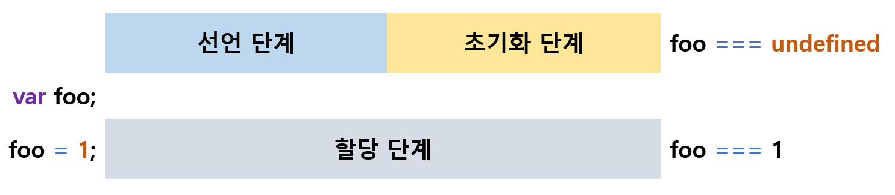
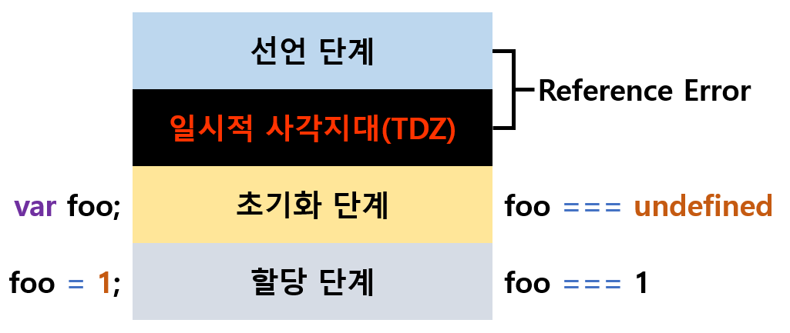

`var` 키워드의 문제점은 이제 충분히 알아가고 있네요. 그럼 이 문제를 어떻게하면 슬기롭게 해결할 수 있을까요? 지금까지도 많이 썼겠지만, ES6에서 등장한 `let`, `const`를 본격적으로 들여다 볼 때입니다!

## let, const 키워드와 블록 레벨 스코프(Block Level Scope)
> ES5까지는 var 키워드로만 변수를 선언했고, 이는 많은 문제점이 있었습니다.

var 키워드로 선언한 변수가 가진 문제점은 아래와 같습니다.
1. 변수 중복 선언 `허용`
2. 함수 레벨 스코프, `function() {}`
3. 변수 호이스팅으로 `변수 선언문 이전에 참조가 가능`하며, 할당문 이전에 참조 시 undefined를 반환
4.`전역 변수`, `전역 함수`, 선언하지 않은 변수에 값을 할당한 `암묵적 전역`은 전역 객체 window의 프로퍼티에 할당

이런 이유로 가독성, 개발자의 의도가 흐려지게 되었고 결국 let과 const가 등장하게 됩니다.

### let
> ES6에 추가된 블록 레벨 스코프의 재할당이 가능한 키워드입니다.

let 키워드로 선언한 변수는 var 키워드를 대체할 수 있으며, 아래와 같은 특징을 갖습니다.
1. 변수 중복 선언 `금지`, 중복 선언 시 문법 에러(SyntaxError) 발생
2. 함수 레벨 스코프, `function() {}, if 문, for 문, while 문, try/catch 문 등`
3. 변수 호이스팅이 `발생하지 않는` 것처럼 동작
    ```js
    // 1 =====================================
    console.log(foo); // ReferenceError: foo is not defined

    let foo;
    console.log(foo); // undefined

    foo = 1;
    console.log(foo); // 1

    // 2 =====================================
    // 전역 변수
    let foo = 1;
    {
      console.log(foo); // ReferenceError: Cannot access 'foo' before initialization
      // 지역 변수
      let foo = 2;
    }
    ```
4. 전역 객체 window의 프로퍼티가 아니며 let 전역 변수는 `보이지 않는 개념적 블록(전역 렉시컬 환경의 선언적 환경 레코드)` 내에 존재

유심히 보아야 하는 것은 3번 항목입니다. `변수 호이스팅이 발생하지 않는다`? 아니요, let, const 키워드로 선언한 변수도 변수 호이스팅은 `발생합니다`. 그러나 내부적인 처리가 틀려요.

자, var 키워드와 let, const 키워드는 `변수의 생명 주기`가 다르게 동작됩니다. 우리는 변수를 배우면서 `변수 선언`에 대해 이해하고 있을테지만, 한 번 더 생각해볼까요?

<br>

<div align='center'>



</div>

<br>

var 키워드로 선언한 변수는 런타임 이전에 자바스크립트 엔진에 의해 암묵적으로 `선언 단계`와 `초기화 단계`가 동시에 진행됩니다. 예제로 이해 해봅시다.

```js
/**
 * var 키워드로 선언한 변수는 런타임 이전에
 * 선언 및 초기화 단계가 실행됩니다.
 * 따라서 변수 선언문 이전에 변수 참조할 수 있습니다.
 */
console.log(foo); // undefined

var foo;
console.log(foo); // undefined
// 할당문에서 할당 단계가 실행됩니다.
foo = 1;
console.log(foo); // 1
```

반면 let, const 키워드로 선언한 변수는 `선언 단계`와 `초기화 단계`가 분리되어 진행됩니다.

<br>

<div align='center'>



</div>

<br>

즉, 런타임 이전에 자바스크립트 엔진에 의해 암묵적으로 선언 단계가 먼저 실행되고, 초기화 단계가 변수 선언문에 도달했을 때 실행됩니다.

```js
// 런타임 이전에 선언 단계가 실행되지만 변수는 초기화되지 않습니다.
console.log(foo); // ReferenceError: foo is not defined

let foo;
console.log(foo); // undefined

foo = 1;
console.log(foo); // 1
```

초기화 단계 이전에 변수에 접근하려고 하면 참조 에러(Reference Error)가 발생하죠. 이렇게 `스코프의 시작지점부터 초기화 시작 지점까지` 변수를 참조할 수 없는 구간을 **일시적 사각지대(TDZ, Temporal Dead Zone)** 라고 부릅니다.

let 키워드로 선언한 변수도 여전히 호이스팅이 발생합니다. 위의 예제를 다시 볼까요?

```js
// 전역 변수
let foo = 1;
{
  console.log(foo); // ReferenceError: Cannot access 'foo' before initialization
  let foo = 2;
}
```

변수 호이스팅이 발생하지 않았다면, 위 코드에서는 전역변수 `foo`의 값을 출력해야 합니다. 그러나 참조 에러가 발생했죠? 이는 지역 변수로 선언한 foo를 출력하기 위해 선언문 이전에 접근했기 떄문입니다.

자바스크립트는 ES6에 도입된 let, const를 포함한 모든 선언을 호이스팅하지만, `let`, `const`,`class`만은 호이스팅이 발생하지 않는 것처럼 동작합니다.

<br>

### const
> ES6에 추가된 블록 레벨 스코프의 재할당 불가능한 상수(constant)를 선언하는 키워드입니다.

const 키워드는 기본적으로 let과 동일하게 동작합니다. 다른 점은 `반드시 선언과 동시에 초기화`해야 한다는 것이에요.

```js
const foo = 1;
foo = 2;  // TypeError: Assignment to constant variable.
```

이유는 위와 같습니다. const 키워드로 선언한 변수는 재할당이 **금지**되기 때문이죠.

변수는 기본적으로 변경이 가능한 값을 뜻합니다. 그와 상대 개념인 **상수**는 재할당이 금지된 변수를 뜻합니다. 상수는 상태 유지, 가독성, 유지보수의 편의를 위해 적극적으로 사용하기를 권장합니다. 재할당이 금지되었으므로 할당된 초기값을 변경할 수 있는 방법은 없습니다.

일반적으로 상수는 대문자로 선언하고, 여러 단어로 이뤄진 경우 언더스코어(`_`)로 구분해 상수임을 명확히 나타냅니다. 아래처럼 말이죠!

```js
const TAX_RATE = 0.1;

let preTaxPrice = 100;
let afterTaxPrice = preTaxPrice + (preTaxPrice * TAX_RATE);

console.log(afterTaxPrice); // 110
```

여기서 착각하지 말아야 할 것은, const로 선언한 **객체**의 경우, 객체 자체를 변경하는 것은 금지되나 객체 내부의 값을 변경하는 것은 가능합니다. 이는 const 키워드가 재할당을 금지하는 것이지 `불변`을 의미하는 것은 아니기 때문입니다. 즉 프로퍼티의 동적 생성, 삭제, 프로퍼티 값 수정을 통해 객체를 `변경하는 것`은 가능하게 됩니다.

물론 객체를 가리키는 주소가 변경될 순 없습니다.

<br>

### `var` vs. `let` vs. `const`
> 변수 선언은 기본적으로 const를 사용하고 재할당이 필요한 경우만 let을 쓰도록 합시다.

권장이지만 여러 상황에 대해 통용되는 내용입니다.
1. ES6를 사용하면 var 키워드는 쓰지 않습니다.
2. 재할당이 필요하면 let, 그 외에는 const를 씁니다.
3. 전역 변수를 남용하지 않습니다.

<hr>
<br>