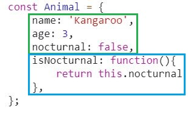
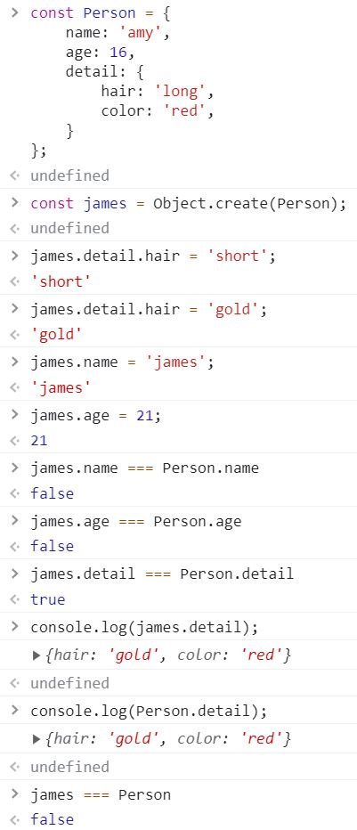

자바스크립트는 객체(Object) 기반 언어입니다. 데이터 타입을 공부하면서 이해했듯이, 원시 값을 제외한 모든 값은 객체입니다.

## 객체(Object)
> 객체는 다양한 타입의 값으로 구성되는 복합적 자료구조이며 변경이 가능한 값입니다.

객체는 키(Key)와 값(Value)으로 구성된 0개 이상의 프로퍼티(Property, 속성)의 집합으로 자바스크립트에서 사용하는 모든 값은 프로퍼티의 키와 값으로 취급할 수 있습니다. 아래 그림을 볼까요?

<br>

<div align=center>



</div>

<br>

`초록색 사각형`은 프로퍼티로서 **객체의 상태를 나타내는 값(data)** 입니다.

`파란색 사각형`은 프로퍼티로도 불리지만, 함수를 구분하기 위해 **메서드**라 부르며 **다른 프로퍼티의 참조 및 조작이 가능한 동작(behavior)** 입니다.

이처럼 객체는 상태와 동작을 모두 포함할 수 있으므로, 상태와 동작을 하나의 단위로 구조화하는데 매우 유용합니다. 그런데, 여기서 고개를 끄덕이기엔 프로퍼티에 대한 지식이 부족한 것 같습니다. 자세히 살펴봐야겠죠?

### 프로퍼티(Property)
> 객체는 키와 값으로 구성된 프로퍼티의 집합입니다.

1. 프로퍼티를 나열할 때는 세미콜론(`;`)이 아니라 쉼표(`,`)로 구분합니다.
2. 프로퍼티 키는 프로퍼티 값에 접근할 수 있는 식별자 역할을 하지만, [식별자 정의 규칙](https://github.com/FECrash/JavascriptCrash/blob/main/Javascript/variable.md#%EC%8B%9D%EB%B3%84%EC%9E%90identifier)을 따를 필요는 없습니다(물론, 이 규칙을 준수한 키와 그렇지 않은 키는 차이가 있긴 해요).
3. 일반적으로 키는 문자열(`Symbol Type`도 가능)을 사용합니다. 식별자 정의 규칙을 준수한다면 **따옴표를 생략**할 수 있지만, 일반적인 경우 따옴표를 사용하는 것을 권장합니다.
4. 문자열과 심볼 이외의 값을 사용하면, **암묵적 타입 변환**을 통해 문자열로 판단합니다.
5. 빈 문자열도 키로서 사용할 수 있지만, 이를 사용할 순 없으니 선언할 가치가 없습니다.
6. [예약어]()를 키로 선언할 수 있지만, 에러가 발생할 수 있으니 권장하지 않습니다.
7. 프로퍼티 값은 중복될 수 있으나, 프로퍼티 키는 중복될 수 없습니다. 즉, 이미 존재하는 키를 다시 선언하면 해당 키와 값이 이를 덮어씁니다.
8. 프로퍼티의 값을 읽는 방법에는 마침표(`.`) 표기법, 대괄호(`[]`) 표기법이 있습니다.
9. 존재하지 않는 프로퍼티에 값을 할당하면 동적으로 생성된 뒤 값이 할당됩니다.
10. 프로퍼티는 `delete` 연산자로 삭제할 수 있습니다. 만약 존재하지 않는 프로퍼티면 에러 없이 무시됩니다.

이런 규약을 바탕으로 코드를 볼까요?
  ```js
  const person = {
    // 권장
    'what-name': 'amy',   // 이 키는 아래처럼 선언하는게 좋습니다.
    'whatName': 'amy',
    age: 16,
    // 비권장
    1: 156,
    function: 'ffffff!',  // 가능하지만 권장하지 않습니다.
    // 에러
    what-name: 'amy',     // SyntaxError
    [what-name]: 'amy',   // ReferenceError
  };

  console.log(person);              // {1: 156, what-name: 'amy', age: 16}

  // (-) 연산자로 평가됩니다. 문자열로 묶어야 프로퍼티 키로 인식합니다.
  console.log(person.what-name);    // NaN
  console.log(person[what-name]);   // ReferenceError: what is not defined
  console.log(person['what-name']); // 'amy'

  // 대괄호는 식별자가 아닌 한 따옴표로 묶어야 합니다.
  console.log(person.age);          // 16
  console.log(person[age]);         // ReferenceError: age is not defined
  console.log(person['age']);       // 16

  // 암묵적 타입 변환이 진행되므로 마침표 표기법으론 문법적 에러가 발생합니다.
  console.log(person['1']);         // 156
  console.log(person[1]);           // 156
  console.log(person.1);            // SyntaxError: missing ) after argument list

  // 나중에 선언된 값으로 프로퍼티가 갱신됩니다.
  person['what-name'] = 'james';         // person.what-name = 'james'와 동일합니다.
  console.log(person['what-name'] );     // 'james'

  // 없는 프로퍼티에 값을 할당하면 동적으로 생성한 뒤 값을 할당합니다.
  person.gender = `female`;
  console.log(person.gender);       // 'female'

  // 프로퍼티 삭제
  console.log(person);              // {1: 156, what-name: 'amy', age: 16, gender: 'female'}
  delete person.gender;             // 프로퍼티가 존재하므로 이를 삭제합니다.
  console.log(person);              // {1: 156, what-name: 'amy', age: 16}
  delete person.name;               // 프로퍼티가 존재하지 않으므로 에러 없이 무시됩니다.
  console.log(person);              // {1: 156, what-name: 'amy', age: 16}
  ```

ES6부터 조금 더 유연하게 객체 리터럴을 확장시킬 수 있습니다. 설명보다는 예제를 보고 이렇게 사용하는구나~ 하며 넘어가시면 돼요!
- 프로퍼티 축약 표현(Property Shorthand) : 프로퍼티 값으로 변수를 사용하는 경우, 변수 이름과 프로퍼티 키가 동일하다면 프로퍼티 키를 생략할 수 있습니다.
  ```js
  let name = 'amy';
  let age = 16;

  const person = {
    name,
    age,
  };

  console.log(person);  // {name: 'amy', age: 16}
  ```
  - 또한 메서드 정의 시 `function` 키워드를 생략할 수 있습니다.
    ```js
    const obj = {
      name: 'amy',
      age: 16,
      sayHi() {
        console.log('Hi, ' + this.name);
      }
    };

    obj.sayHi();  // 'Hi, amy'
    ```

- 계산된 프로퍼티 이름(Computed Property Name) : 프로퍼티 키를 대괄호(`[]`)로 묶어 표현식을 통해 동적으로 생성할 수 있습니다.
  ```js
  const pre = 'no';
  let index = 0;

  // 템플릿 리터럴을 사용한 예
  const obj = {
    [`${pre}${++index}`] : index,
    [`${pre}${++index}`] : index,
    [`${pre}${++index}`] : index,
  };

  console.log(obj);     // {no1: 1, no2: 2, no3: 3}
  ```

프로퍼티에 대해 이해가 되었나요? 자, 그렇다면 객체 지향 언어와는 다른 자바스크립트는 이 객체를 어떻게 선언할까요?

<br>

### 객체 생성
> 자바스크립트는 프로토타입 기반 객체 지향 언어로, 객체 생성 방법이 별도로 존재합니다.

각 생성 방법을 예제와 함께 확인해보죠.

- 객체 리터럴 [MDN Link](https://developer.mozilla.org/ko/docs/Web/JavaScript/Reference/Operators/Object_initializer)
  ```js
  const emptyObj = {};
  console.log(typeof emptyObj); // object

  // 객체의 선언과 프로퍼티 정적 할당
  const person = {
    name: 'J',
    gender: 'male',
    sayHi: function () {
      console.log('Hi, ' + this.name);
    }
  };

  console.log(typeof person);   // object
  console.log(person);          // {name: "J", gender: "male", sayHi: ƒ}
  person.sayHi();               // 'Hi, J'
  ```
  - 중괄호(`{}`)를 사용하여 키, 값을 나열해 객체를 생성합니다. 프로퍼티가 존재하지 않으면 빈 객체가 생성됩니다.

- Object 생성자 함수 [MDN Link](https://developer.mozilla.org/ko/docs/Web/JavaScript/Reference/Global_Objects/Object)
  ```js
  const person = new Object();  // 빈 객체의 생성
  // 프로퍼티 동적 할당
  person.name = 'J';
  person.gender = 'male';
  person.sayHi = function () {
    console.log('Hi, ' + this.name);
  };

  console.log(typeof person);   // object
  console.log(person);          // {name: "J", gender: "male", sayHi: ƒ}
  person.sayHi();               // 'Hi, J'
  ```
  - **생성자(constructor) 함수**는 new 연산자와 함께 사용되면 객체 생성 및 초기화를 자동으로 진행하며, 이렇게 생성된 객체를 **인스턴스(instance)** 라고 부릅니다.
  - Object 이외에도 많은 빌트인 생성자 함수(Built-in Constructor Function)을 제공하는데, String, Number, Array, Date, RegExp 등이 바로 이것입니다.
  - 일반 함수와 구분하기 위해 `파스칼 케이스(Pascal Case)`로 표기합니다.
  - **객체 리터럴 방식은 Object 생성자 함수를 단순화 시킨 형태라는 것을 기억해주세요**.

- new 연산자 [MDN Link](https://developer.mozilla.org/ko/docs/Web/JavaScript/Reference/Operators/new)
  ```js
  // 생성자 함수를 통한 객체 선언
  function Person(name, gender) {
    const married = true;       // private
    this.name = name;           // public
    this.gender = gender;       // public
    this.sayHi = function(){
      console.log('Hi, ' + this.name);
    };                          // public
  }

  // 생성자 함수를 사용한 인스턴스의 생성
  const person = new Person('J', 'male');

  console.log(typeof person);   // object
  person.sayHi();               // 'Hi, J'
  console.log(person.married);  // undefined
  console.log(person.gender);   // 'male'
  ```
  - `this`가 등장했는데, 매우 중요한 내용이므로 분리하여 다룹니다. 이 `this`의 역할은 생성자 함수가 생성한 인스턴스를 가리키고 있습니다.
  - this에 바인딩(Binding, 연결)된 프로퍼티와 메서드는 외부에서 참조가 가능(public)하지만, `const married` 같이 선언된 일반 변수는 외부에서 참조가 불가능(private)합니다.
  - 이렇게 `new` 연산자를 붙여 호출하면 해당 함수는 자동으로 생성자 함수로 동작합니다! 또한 `this Binding`이 다르게 동작하니 이는 다른 장에서 다룹니다.

- Object.create 메서드 [MDN Link](https://developer.mozilla.org/ko/docs/Web/JavaScript/Reference/Global_Objects/Object/create)
  ```js
  // Person - 상위 클래스
  function Person(name, age) {
    this.name = name;
    this.age = age;
  }

  // 상위클래스 메서드
  Person.prototype.getOnInYears = function(age) {
    this.age += age;
    console.info('get on in years, age : ' + this.age);
  };

  // Student - 하위클래스
  function Student(name, age) {
    Person.call(this); // super 생성자 호출.
    this.name = name;
    this.age = age;
  }

  // 하위클래스는 상위클래스를 확장
  Student.prototype = Object.create(Person.prototype);
  Student.prototype.constructor = Student;

  const amy = new Student('Amy', 16);

  console.log(amy instanceof Student);  // true
  console.log(amy instanceof Person);   // true
  amy.getOnInYears(1);                  // 'get on in years, age : 17'
  ```
  - `Object.create()` 메서드는 지정된 프로토타입 객체 및 속성(property)을 갖는 새 객체를 생성합니다.

  <br>

  <div align=center>

  

  </div>

  <br>

  - 이처럼 `Object.create()` 메서드로 생성된 객체와, 메서드의 인자가 된 객체는 서로 다릅니다. 이는 원시 값과 객체 주소를 비교해보면 알 수 있죠. 그러나, 프로퍼티 값이 객체 타입인 경우 동일한 주소를 바라보고 있기에 **얕은 복사** 되었다고 할 수 있습니다.
  - 이러한 문제로 `Object.create()` 메서드는 객체 복사의 기능으로 활용하기엔 추가적인 로직을 작성할 필요가 있습니다(재귀적인 호출). 얕은 복사, 그와 대응되는 개념인 **낖은 복사**는 다른 장에서 다룹니다.


- Class(ES6) [MDN Link](https://developer.mozilla.org/ko/docs/Web/JavaScript/Reference/Classes)
  ```js
  class Person {
    constructor(name, age) {
    this.name = name;
    this.age = age;
    }

    static displayName = "unnamed";
    static whoOlder(a, b) {
      const dx = a.age - b.age;
      if(dx === 0) return 'friend';
      return dx > 0 ? `Older is ${a.name}` : `Older is ${b.name}`;
    }
  }

  const person1 = new Person('amy', 16);
  const person2 = new Person('james', 17);
  person1.displayName;  // undefined
  person1.whoOlder;     // undefined
  person2.displayName;  // undefined
  person2.whoOlder;     // undefined

  console.log(Person.displayName);                // 'unnamed'
  console.log(Person.whoOlder(person1, person2)); // 'Older is james'
  ```
  - ES6에서 추가된, 문법적 설탕(Syntactic sugar)인 기존 프로토타입 기반 패턴의 생성 방법입니다.
  - Class 선언은 호이스팅(Hoisting)이 일어나지 **않습니다**. 클래스를 선언하기 이전에 사용하면 `ReferenceError(참조 에러)`가 발생합니다.
  - 여기서 다루기에는 방대하니 다른 장으로 분리합니다.

객체 리터럴을 제외한 나머지 네 가지 방법은 함수(프로토타입 기반)를 사용하여 객체를 생성하는 것을 꼭 알아두세요.

<br>
<hr>
<br>

> 2021-09-11, <a href="https://github.com/karohani">karohani</a>와 스터디 중 식별된 추가적으로 공부가 필요한 내용들

## ✅ 자바스크립트의 메모리 관리
### 의문점
- 자바스크립트는 힙 메모리에 할당하여 사용했던 객체 값들이 필요 없어졌을 때, 어떻게 `Garbage Collection`할까요?

### 정리 된 내용
- C, C++, Python은 스마트 포인터(Smart Pointer)로 **참조 횟수 계산 방식(Reference Counting)** 알고리즘을 사용합니다.
- Java, JavaScript는 **표시하고-쓸기(Mark-and-Sweep)** 알고리즘을 사용합니다.

- 참조 [Link](https://developer.mozilla.org/ko/docs/Web/JavaScript/Memory_Management#mark-and-sweep_algorithm)

<hr>
<br>