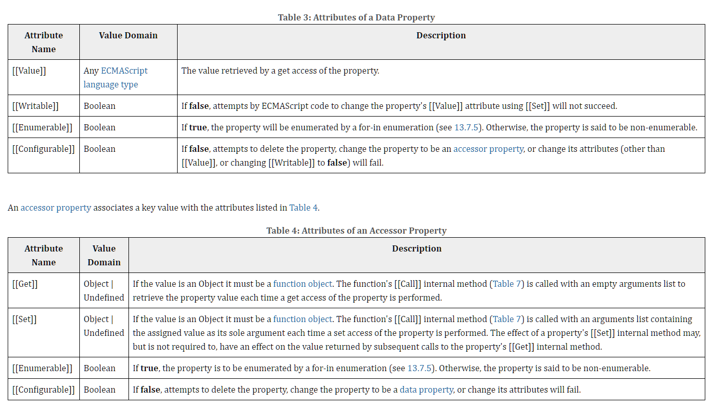

객체를 다루면서 프로퍼티(Property)에 대해 어느정도 알고 있었죠? 이제 그 프로퍼티를 뜯어봅니다! 하지만 반드시 알아야 하는 내용을 내포하진 않으므로, 필요에 의한 참조로 접근해주세요.

## 프로퍼티 어트리뷰트(Property Attribute)
> 자바스크립트 엔진은 프로퍼티를 생성할 때 프로퍼티의 상태를 나타내는 프로퍼티 어트리뷰트(Property Attribute)를 기본값으로 자동 정의합니다.

그 전에, 내부 슬롯(Internal Slot)과 내부 메서드(Internal Method)에 대해 짚고 넘어가죠. 내부 슬롯과 내부 메서드는 자바스크립트 엔진의 구현 알고리즘을 설명하기 위해 ECMAScript 사양에서 사용하는 의사 프로퍼티(Pseudo Property)와 의사 메서드(Pseudo Method)입니다.

<br>

<div align='center'>



</div>

<br>

위 그림처럼 이중 대괄호(`[[]]`)로 감싼 이름들이 내부 슬롯과 내부 메서드입니다. 원칙적으로 자바스크립트는 내부 슬롯과 내부 메서드에 직접적인 접근 및 호출을 금지하고 있습니다. 단 일부에 한해 간접적으로 접근 가능한 수단을 제공합니다.

예를 들어 모든 객체는 `[[Prototype]]`이라는 내부 슬롯을 갖고, `__proto__`를 통해 간접적으로 접근할 수 있습니다. 아래 처럼요!

```js
const obj = {};

obj.[[Prototype]];  // SyntaxError: Unexpected token '['
obj.__proto__;      // {constructor: ƒ, …}
```

<br>

자, 그럼 프로퍼티 어트리뷰트에 대해 알아볼 차례입니다.

### 프로퍼티 어트리뷰트와 디스크립터 객체
> 자바스크립트 엔진이 관리하는 내부 상태 값(Meta Propert)인 내부 슬롯입니다.

프로퍼티 어트리뷰트에 직접 접근할 수는 없습니다. 이유는 상술했죠? 그러나 `Object.getOwnPropertyDescriptor` 메서드로 간접적인 확인이 가능합니다. 이 메서드는 프로퍼티 어트리뷰트 정보를 제공하는 **프로퍼티 디스크립터(Property Descriptor)** 객체를 반환합니다. 만약 존재하지 않는 프로퍼티에 대해 디스크립터를 요구하면 `undefined`가 반환됩니다.

```js
const person = {
    name : 'amy'
};
person.age = 16;
console.log(Object.getOwnPropertyDescriptors(person));
/*
{
  name: { value: 'amy', writable: true, enumerable: true, configurable: true },
  age: { value: 16, writable: true, enumerable: true, configurable: true }
}
*/
```

ES8에는 복수의 프로퍼티 어트리뷰트 정보를 제공하는 `getOwnPropertyDescriptors` 함수도 추가되었지만... 알아만 두세요!

프로퍼티는 데이터 프로퍼티(Data Property)와 접근자 프로퍼티(Accessor Property)로 구분합니다.

- 데이터 프로퍼티는 키와 값으로 구성되고 지금껏 살펴본 모든 프로퍼티가 여기에 해당하며, 자바스크립트 엔진이 프로퍼티를 생성할 때 기본값으로 자동 정의합니다.
  | 프로퍼티 어트리뷰트 | 설명                                                                                                                                                                                                                                            |
  | ------------------- | ----------------------------------------------------------------------------------------------------------------------------------------------------------------------------------------------------------------------------------------------- |
  | `[[Value]]`         | ✅ 프로퍼티 키를 통해 프로퍼티 값을 접근하면 반환되는 값입니다.<br>✅ 프로퍼티 키를 통해 프로퍼티 값을 변경하면 `[[Value]]`에 값을 재할당합니다. 이 때 프로퍼티가 없으면 프로퍼티를 동적 생성하고 생성된 프로퍼티 `[[Value]]`에 값을 저장합니다.  |
  | `[[Writable]]`      | ✅ 프로퍼티 값의 변경 가능 여부를 나타내며 boolean 값을 갖습니다.<br>✅ `[[Writable]]`이 false인 경우 해당 프로퍼티의 `[[Value]]` 값을 변경할 수 없는 읽기 전용 프로퍼티가 됩니다.                                                                |
  | `[[Enumerable]]`    | ✅ 프로퍼티의 열거 가능 여부를 나타내며 boolean 값을 갖습니다.<br>✅ `[[Enumerable]]`의 값이 false인 경우 해당 프로퍼티는 for ... in 이나 Object.keys 메서드 등으로 열거할 수 없습니다.                                                           |
  | `[[Configurable]]`  | ✅ 프로퍼티의 재정의 가능 여부를 나타내며 boolean값을 갖습니다.<br>✅ `[[Configurable]]`의 값이 false인 경우 삭제나 변경이 금지됩니다. 단, `[[Writable]]`이 true인 경우는 `[[Value]]`의 변경과 `[[Writable]]`을 false로 변경하는 것이 허용됩니다. |

- 접근자 프로퍼티는 자체적으로 값을 갖지 않으나 데이터 프로퍼티의 값을 읽거나 수정할 때 호출되는 접근자 함수(Accessor Function)로 구성된 프로퍼티입니다. 접근자 함수는 `getter/setter` 함수라고도 부릅니다.

  | 프로퍼티 어트리뷰트 | 설명                                                                                                                                                                                                                                    |
  | ------------------- | --------------------------------------------------------------------------------------------------------------------------------------------------------------------------------------------------------------------------------------- |
  | `[[Get]]`           | ✅ 접근자 프로퍼티를 통해 데이터 프로퍼티 값을 읽을 때 호출되는 접근자 함수입니다.<br>✅ 접근자 프로퍼티 키로 프로퍼티 값에 접근하면 프로퍼티 어트리뷰트 `[[Get]]`의 값, getter 함수가 호출되고 그 결과가 프로퍼티 값으로 반환됩니다.     |
  | `[[Set]]`           | ✅ 접근자 프로퍼티를 통해 데이터 프로퍼티의 값을 저장할 때 호출되는 접근자 함수입니다.<br>✅ 접근자 프로퍼티 키로 프로퍼티 값을 저장하면 프로퍼티 어트리뷰트 `[[Set]]`값, 즉 setter 함수가 호출되고 그 결과가 프로퍼티 값으로 저장됩니다. |
  | `[[Enumerable]]`    | ✅ 데이터 프로퍼티의 enumerable과 같습니다.                                                                                                                                                                                              |
  | `[[Configurable]]`  | ✅ 데이터 프로퍼티의 configurable과 같습니다.                                                                                                                                                                                            |
  - 접근자 프로퍼티로 프로퍼티 값에 접근하면 어떻게 동작할까요?
    - 1️⃣ 프로퍼티 키가 유효한지 확인합니다. 프로퍼티 키는 문자열이거나 심볼이어야 합니다.
    - 2️⃣ 프로토타입 체인에서 프로퍼티를 검색합니다.
    - 3️⃣ 검색된 프로퍼티가 데이터 프로퍼티인지 접근자 프로퍼티인지 확인합니다.
    - 4️⃣ 접근자 프로퍼티의 프로퍼티 어트리뷰트 `[[Get]]`의 값인 getter를 호출하여 그 결과를 반환합니다.

> 잠깐, 프로토타입 체인?
- 어려운 단어가 나왔네요? 프로토타입 체인이라니. 프로토타입(Prototype)은 어떤 객체의 상위(부모) 객체 역할을 하는 `객체`입니다. 이 프로토타입을 통해 우리는 객체 지향 프로그램처럼 상속과 확장을 할 수 있죠. 프로토타입 체인(Prototype Chain)은 프로토타입이 단방향 링크드 리스트(Linked List)로 연결된 상속 구조를 뜻합니다.

<br>

### 프로퍼티 정의
> 새로운 프로퍼티를 추가하면서 프로퍼티 어트리뷰트를 명시적으로 정의하거나, 기존 프로퍼티 어트리뷰트를 재정의하는 것입니다.

Object.defineProperty 메서드를 사용하면 프로퍼티 어트리뷰트를 정의할 수 있습니다.

```js
const person = {};

Object.defineProperty(person, 'firstName', {
    value : 'Chil',
    writable : true,
    enumerable : true,
    configurable : true
})

Object.defineProperty(person, 'lastName', {
    value : 'Amy',
})

let descriptor = Object.getOwnPropertyDescriptor(person, 'firstName');
console.log('firstName', descriptor);
// firstName {
//   value: 'Chil',
//   writable: true,
//   enumerable: true,
//   configurable: true
// }

descriptor = Object.getOwnPropertyDescriptor(person, 'lastName');
console.log('lastName', descriptor);
// lastName {
//   value: 'Amy',
//   writable: false,
//   enumerable: false,
//   configurable: false
// }
console.log(Object.keys(person));
//[ 'firstName' ]
person.lastName = "J";
delete person.lastName;

descriptor = Object.getOwnPropertyDescriptor(person, 'lastName');
console.log('lastName', descriptor);
// lastName {
//   value: 'Amy',
//   writable: false,
//   enumerable: false,
//   configurable: false
// }
Object.defineProperty(person, 'fullName', {
    get() {
        return `${this.firstName} ${this.lastName}`
    }
    set(name){
        [this.firstName, this.lastName] = name.split(' ');
    }
    enumberable : true,
    configurable : true
});

descriptor = Object.getOwnPropertyDescriptor(person, 'fullName');
console.log(descriptor);
// {
//   get: [Function: get],
//   set: [Function: set],
//   enumerable: false,
//   configurable: true
// }
person.fullName = "thin Amy";
console.log(person);
// { firstName: 'thin' }
```

프로퍼티 디스크립터 객체에서 생략된 어트리뷰트는 다음과 같은 기본값이 적용됩니다.

| 프로퍼티 디스크립터 객체의 프로퍼티 | 대응하는 프로퍼티 어트리뷰트 | 생략했을 때의 기본값 |
| ----------------------------------- | ---------------------------- | -------------------- |
| value                               | `[[Value]]`                  | undefined            |
| get                                 | `[[Get]]`                    | undefined[           |
| set                                 | `[[Set]]`                    | undefined            |
| writable                            | `[[Writable]]`               | false                |
| enumerable                          | `[[Enumerable]]`             | false                |
| configurable                        | `[[Configurable]]`           | false                |

복수의 프로퍼티를 정의하는 `defineProperties` 함수도 존재하지만... 알아만 두세요!

<br>

### 객체 변경 방지
> 객체는 변경 가능한 값이므로 재할당 없이 직접 변경할 수 있습니다. 이를 방지하려면 어떻게 할까요?

자바스크립트는 객체 변경 방지를 위해 아래와 같은 메서드를 제공합니다.

| 구분           | 메서드                   | 프로퍼티 추가 | 프로퍼티 삭제 | 프로퍼티 값 읽기 | 프로퍼티 값 쓰기 | 프로퍼티 어트리뷰트 재정의 |
| -------------- | ------------------------ | :-----------: | :-----------: | :--------------: | :--------------: | :------------------------: |
| 객체 확장 금지 | Object.preventExtensions |       X       |       O       |        O         |        O         |             O              |
| 객체 밀봉      | Object.seal              |       X       |       X       |        O         |        O         |             X              |
| 객체 동결      | Object.freeze            |       X       |       X       |        O         |        X         |             X              |

추가적으로 객체를 불변 객체로 만들기 위해서는 Object.freeze 메서드를 재귀적으로 호출해야 합니다.

```js
function deepFreeze(target){
    if(target && typeof target === 'object' && !Object.isFrozen(target)){
        Object.freeze(target);
        Object.keys(target).forEach(key => deepFreeze(target[key]));
    }
}
const person = {
    name : 'Amy',
    address: {city : 'LA'}
};

deepFreeze(person)
console.log(Object.isFrozen(person));         // true
console.log(Object.isFrozen(person.address)); // true

person.address.city = 'Seoul';
console.log(person);                          // {name: 'Amy', address: {city: 'Seoul'}}
```

<hr>
<br>