자바스크립트는 명령형(Imperative), 함수형(Functional), 객체 지향 프로그래밍(OOP)을 지원하는 프로토타입 기반(Prototype-based) 멀티 패러다임 언어입니다. 우리는 이 장에서 생소했던 개념인 `프로토타입`에 대해 알아봅니다.

<br>

## 객체 지향 프로그래밍
> 프로그램을 여러 독립적 단위인 객체(Object)의 집합으로 프로그램을 표현하려는 패러다임입니다.

객체 지향 프로그래밍은 현실에 존재하는 실체(사물과 개념을 뜻합니다)를 프로그래밍에 접목하는 철학의 시도에서 시작됩니다. 예를 들어 현실에서의 `사람`은 특징과 성질을 나타내는 `이름`, `성별`, `나이` 등 다양한 **속성(Attribute/Property)** 을 가집니다. 이를 구체적으로 `이름은 Amy, 여자이고 16살이야.` 표현하면 그 대상을 특정할 수 있죠.

자, 객체 지향 프로그래밍은 이를 접목시킵니다. 다양한 속성을 만들어두고, 프로그램에 필요한 속성만 세부적으로 뽑아 표현하면 원하는 대상을 특정할 수 있겠죠? 이렇게 필요한 속성으로 표현하는 것을 `추상화(Abstract)`라고 합니다. 지금껏 우리가 예제로 표현했던 객체를 볼까요?
- 이름과 성별, 나이라는 속성을 갖는 객체
  ```js
  const person = {
    name: 'amy',
    gender: 'female',
    age: 16
  }
  ```

우리는 이로써 수 많은 객체 중에 person이라는 객체를 특정하여 선택할 수 있습니다. 즉, 객체란 `속성으로 여러 값을 하나의 단위로 묶은 복합적인 자료구조`입니다. 그렇다면 객체 지향 프로그래밍은 무엇일까요? 앞서 말한 객체의 집합으로 프로그래밍을 표현하는 방법입니다. 예제를 봅시다.
- 원(Circle) 개념을 객체로 나타내기
  ```js
  const circle = {
    // 반지름
    radius: 5,
    // 원의 지름
    getDiameter(){
      return 2 * this.radius;
    },
    // 원의 둘레
    getPerimeter(){
      return 2 * Math.PI * this.radius;
    },
    // 원의 넓이
    getArea(){
      return Math.PI * this.radius ** 2;
    }
  };

  console.log(circle); // {radius: 5, getDiameter: ƒ, getPerimeter: ƒ, getArea: ƒ}
  console.log(circle.getDiameter());  // 10
  console.log(circle.getPerimeter()); // 31.41592653589793
  console.log(circle.getArea());      // 78.53981633974483
  ```

원에는 반지름이라는 속성이 있는데, 이 속성을 **원(Circle)의 상태(State)를 나타내는 데이터**라 말하며 이 상태를 통해 어떤 것을 구하는 걸 **동작**이라고 합니다. 정리해볼까요? 

객체 지향 프로그래밍은 객체의 상태를 나타내는 데이터와 상태 데이터를 조작할 수 있는 동작을 하나의 논리적 단위로 묶습니다. 즉, 객체는 상태 데이터와 동작을 하나의 논리적 단위로 묶은 복합적 자료구조이며, 우리가 알고 있는 프로퍼티가 상태 데이터, 메서드가 동작이 됩니다. 이런 객체의 추가적인 기능은 아래와 같아요.
1. 자신만의 기능을 수행함과 동시에 다른 객체와 관계(Relation)를 가집니다.
2. 다른 객체와 통신(메세지나 데이터를 송수신 및 처리)할 수 있습니다.
3. 다른 객체의 상태 데이터와 동작을 `상속`받을 수 있습니다.

다시 생소한 개념이 나왔네요. **상속**이 뭘까요?

<br>

## 상속과 프로토타입
> 특정 객체를 다른 객체가 상속(Inheritance)받아 그대로 사용할 수 있는 것입니다.

자바스크립트의 프로토타입 기반의 상속을 구현해 기존 코드를 적극적으로 재사용합니다. 이는 코드의 중복을 제거하는데 매우 효율적이죠. 자, 예제를 보기에 앞서 우리는 원시 값과 객체에 대해 배웠습니다. 그 부분을 잘 상기하면서 진행해볼까요?

```js
// 생성자 함수(Constructor)
function Circle(radius) {
  // 프로퍼티
  this.radius = radius;

  // 메서드
  this.getArea = function () {
    return Math.PI * this.radius ** 2;
  };
}

// 반지름 1의 인스턴스(Instacne) 생성
const circle1 = new Circle(1);
// 반지름 2의 인스턴스(Instacne) 생성
const circle2 = new Circle(2);

console.log(circle1.getArea === circle2.getArea); // false

console.log(circle1.getArea());                   // 3.14...
console.log(circle2.getArea());                   // 12.56...
```

생성자 함수는 동일한 프로퍼티 구조를 갖는 객체를 여러 개 생성할 때 매우 유용하죠. 그러나 큰 문제가 있습니다. `this.radius` 같은 프로퍼티 값은 일반적으로 인스턴스마다 다릅니다. 같은 상태를 가진다면 프로퍼티가 같을 수도 있지만... 그러나 `this.getArea()` 같은 메서드는 모든 인스턴스가 동일한 내용의 메서드를 사용하죠. 

오, 그럼 인스턴스들은 메서드를 **공유**하는 형태가 맞는 것 같아요. 그런데 위의 예제에서 `console.log(circle1.getArea === circle2.getArea);`의 구문은 false가 출력됩니다. 이것은 인스턴스를 생성할 때마다 모든 프로퍼티가 재 생성되면서 모든 인스턴스가 중복 소유한다는 것을 시사하죠.

<br>

<div align='center'>

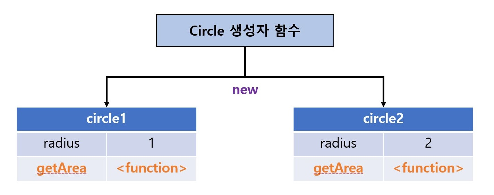

</div>

<br>

이 말을 쉽게 풀자면, 동일한 생성자 함수로 생성된 인스턴스가 100개라면 100개의 getArea 메서드가 중복된다는 뜻입니다. 당연히 메모리를 낭비하게 되고, 성능(Performance)을 저하시키게 돼요. 우리는 이런 큰 문제를 **프로토타입 기반의 상속**을 구현함으로써 해결할 수 있습니다.

```js
// 생성자 함수(Constructor)
function Circle(radius) {
  // 프로퍼티
  this.radius = radius;
}

// 프로토타입
Circle.prototype.getArea = function(){
  return Math.PI * this.radius ** 2;
}

// 반지름 1의 인스턴스(Instacne) 생성
const circle1 = new Circle(1);
// 반지름 2의 인스턴스(Instacne) 생성
const circle2 = new Circle(2);

console.log(circle1.getArea === circle2.getArea); // true

console.log(circle1.getArea());                   // 3.14...
console.log(circle2.getArea());                   // 12.56...
```

`console.log(circle1.getArea === circle2.getArea);`의 구문이 true가 되었네요! 무슨 일일까요?

이 비밀을 밝히자면 자바스크립트 엔진의 프로토타입 기반의 상속에 의한 것입니다. 조금 더 자세히 설명하자면, Circle 생성자 함수가 생성한 모든 인스턴스는 상위 객체 역할인 Circle.prototype의 모든 프로퍼티와 메서드를 상속 받기 때문이에요. getArea는 Circle의 프로토타입으로 단 하나만 생성되어 할당되었습니다. 그럼 Circle의 생성자 함수로 생성된 모든 인스턴스는 getArea 메서드를 상속받아 사용할 수 있게 돼요.

즉, 자신의 상태를 나타내는 데이터는 **개별적으로 소유**하고, 동일한 기능을 나타내는 동작은 **상속을 통해 공유하**는 것이죠. 이 것이 상속이 가지는 코드의 재사용성 이점입니다!

<br>

## 프로토타입 객체
> 자바스크립트의 모든 객체는 자신의 부모 역할을 담당하는 객체와 연결되어 있습니다. 이는 객체 지향 프로그래밍의 상속처럼 부모 객체의 기능을 상속받아 사용할 수 있게 합니다. 이런 부모 객체를 프로토타입(Prototype) 객체, 줄여서 프로토타입(Prototype)이라고 해요.

내부 슬롯과 내부 메서드에서 언급했듯 모든 객체는 `[[Prototype]]`이라는 내부 슬롯을 가지고, 해당 슬롯에 저장되는 프로토타입은 객체 생성 방식에 의해 결정됩니다.

> ✋ 잠깐! `[[Prototype]]`에 직접 접근은 불가능해도, `__proto__` 접근자 프로퍼티로 내부 슬롯이 가리키는 프로토타입에 간접적으로 접근할 수 있죠? 그럼 아래의 프로세스가 가능해집니다.
> - 프로토타입은 자신의 constructor 프로퍼티를 통해 생성자 함수에 접근할 수 있습니다.
> - 생성자 함수는 자신의 prototype 프로퍼티를 통해 프로토타입에 접근할 수 있습니다.

<br>

<div align='center'>

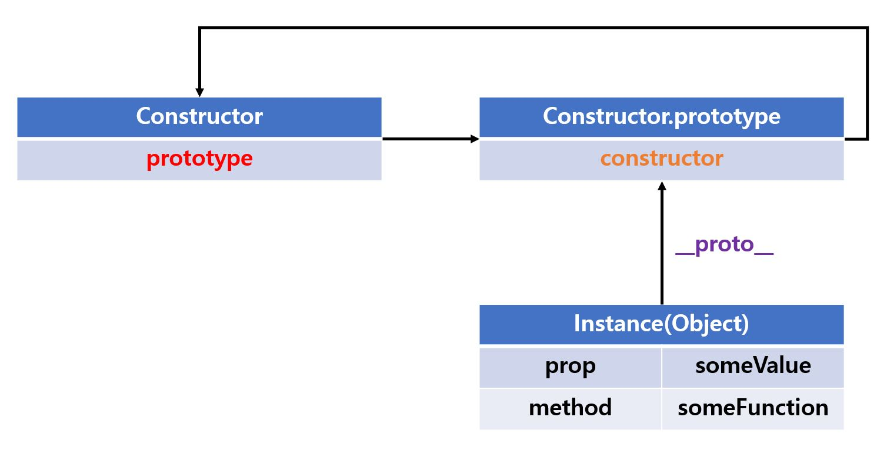

</div>

<br>

결국 모든 객체는 `하나의 프로토타입`을 갖게 돼죠. 따라서 모든 프로토타입은 생성자 함수와 연결되어 있다고 말할 수 있습니다.

다음 장으로 넘어가기 전에, 접근자 프로퍼티인 `__proto__`에 대해 언급합니다.

### `__proto__` 접근자 프로퍼티
> 모든 객체는 `__proto__` 접근자 프로퍼티로 자신의 프로토타입인 `[[ProtoType]]` 내부 슬롯에 간접적으로 접근할 수 있습니다.

<br>

<div align='center'>

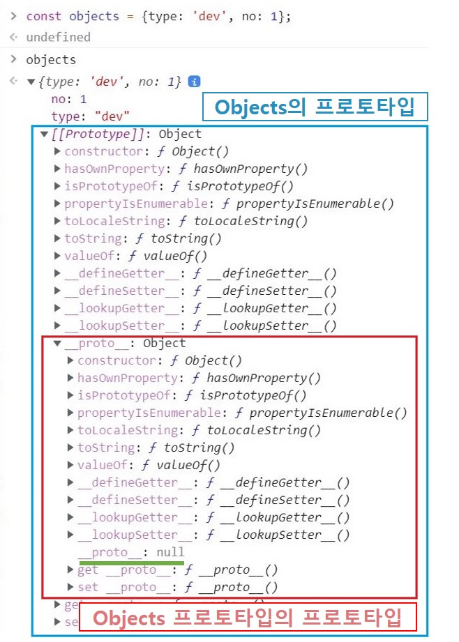

</div>

<br>

> 현재 브라우저 사양이 업데이트가 되었는지, [[Prototype]]이 출력되는 것을 볼 수 있습니다. 이 내용은 체크해두고 다시 확인해야겠어요. 😇

위 그림의 파란색 박스는 `objects`라는 객체의 프로토타입인 `Object.prototype`입니다. 출력에는 `[[Prototype]]`으로 되어 있지만, 내부적인 동작은 `__prototype__`접근자 프로퍼티를 통해 `[[Prototype]]` 내부 슬롯이 가리키는 Object.prototype 객체에 접근한 결과를 표시해준 것이죠.

`__proto__`에 대해 정리하고 넘어가죠.

- `__proto__`는 **접근자 프로퍼티**입니다.
  ```js
  const data = Object.getOwnPropertyDescriptor(Object.prototype, '__proto__');
  console.log(data);
  ```

  <br>

  <div align='center'>

  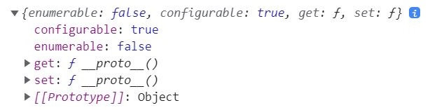

  </div>

  <br>

  - Object.prototype의 접근자 프로퍼티 `__proto__`는 접근자 함수를 통해 `[[Prototype]]` 내부의 슬롯 값인 프로토타입을 **취득(Get)** 하거나 **할당(Set)** 합니다.
  - `__proto__ `접근자 프로퍼티를 사용하는 프로세스는 이렇습니다.
    ```js
    const obj = {};
    const parent = {x : 1};
    // 1번
    obj.__proto__;
    // 2번
    obj.__proto__ = parent;

    console.log(obj.x); // 1
    ```
    1. 프로토타입 접근 시 : `__proto__`의 getter 함수 `[[Get]]` 호출
    2. 프로토타입 할당 시 : `__proto__`의 setter 함수 `[[Set]]` 호출

<br>

- `__proto__` 접근자 프로퍼티는 **상속을 통해 사용**됩니다.
  - 해당 프로퍼티는 객체가 직접 소유하는 것이 아닌 Object.prototype의 프로퍼티이므로 모든 객체는 상속을 통해 `Object.prototype.__proto__`를 사용할 수 있습니다.

    > Object.prototype에 대해서는 아래의 **프로토타입 체인**에서 다루니 걱정 마시고 프로토타입 체인의 **최상위 객체**로서 Object.prototype에 할당된 프로퍼티와 메서드는 **모든 객체에 상속**된다는 것만 알아두세요.

  ```js
  const circle = { radius: 5};

  // 1번
  console.log(circle.hasOwnProperty('__proto__'));
  // 결과 : false

  // 2번
  console.log(Object.getOwnPropertyDescriptor(Object.prototype, '__proto__'));
  // 결과 : {enumerable: false, configurable: true, get: ƒ, set: ƒ}

  // 3번
  console.log({}.__proto__ === Object.prototype);
  // 결과 : true
  ```
  - 1번 : circle 객체는 `__proto__`를 소유하지 않습니다.
  - 2번 : `__proto__` 프로퍼티는 모든 객체의 프로포타입 객체인 Object.prototype의 접근자 프로퍼티입니다.
  - 3번 : 모든 객체는 Object.prototype의 접근자 프로퍼티 `__proto__`를 상속받을 수 있습니다.

<br>

- `__proto__` 접근자 프로퍼티를 통해 프로토타입에 접근하는 이유
  - **상호 참조**로 프로토타입 체인이 생성되는 것을 방지하기 위해서입니다.
    > 상호 참조(Cross-reference), 순환 참조(Circular-reference)라고도 하며, 서로가 서로를 참조하는 관계를 말합니다.
    ```js
    const person1 = {};
    const person2 = {};

    person1.__proto__ = person2;
    person2.__proto__ = person1;  // TypeError: Cyclic __proto__ value
    ```
    - 에러가 발생하지 않는다면 어떨까요? 생각해봅시다. 프로토타입에는 체인이 존재하는데, 이 체인의 종점(끝)이 서로를 참조하게 되면 무한적으로 반복되겠죠? 이렇게 말이에요.

      <br>

      <div align='center'>

      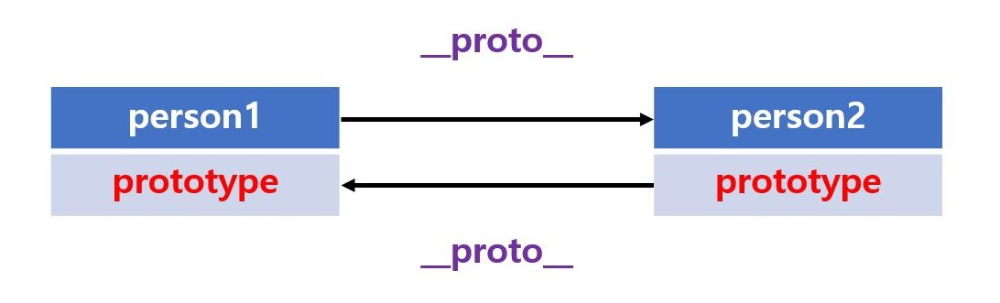

      </div>

      <br>

    - 따라서 무조건 프로토타입을 교체할 수 없게 양방향이 아닌, **단방향**으로 연결되게끔 `__proto__` 접근자 프로퍼티를 통해 접근 및 교체가 가능하도록 제약을 걸어놓은 것입니다.

<br>

- `__proto__` 접근자 프로퍼티를 직접 사용하지 마세요.
  - 본디 __proto__ 접근자 프로퍼티는 ES5까지 비표준이었습니다. 그러나 몇몇 브라우저가 이를 지원하고 있었으므로 호환성을 고려하여 ES6를 __proto__를 표준으로 채택한 것 뿐입니다.
  - 권장되지 않는 이유는 **모든 객체가 `__proto__` 접근자 프로퍼티를 사용할 수 있는 것이 아니기 때문**이죠. 아래의 경우 `__proto__`를 상속받지 못합니다.
    ```js
    const obj = Object.create(null);
    ```
    - 새로 객체를 생성하므로, 프로토타입 종점에 존재하는 객체가 되므로 `__proto__`가 null이 됩니다.
  - 따라서 아래와 같이 사용해주세요. 기능은 정확하게 일치합니다.
    1. 프로토타입 참조 취득 시 : `Object.getPrototypeOf()`, ES5에서 도입
    2. 프로토타입 교체 시 : `Object.setPrototypeOf()`, ES6에서 도입

<br>

### 함수 객체의 prototype 프로퍼티
> 함수 객체만이 소유하는 프로토타입 프로퍼티가 존재합니다. 이는 생성자 함수가 생성할 인스턴스의 프로토타입을 가리킵니다.

이것이 일반 객체와 함수 객체가 다른 프로토타입을 갖는 이유입니다. 그러나 생성자 함수로 호출할 수 없는 `non-constructor 함수`는 프로토타입 프로퍼티가 존재하지도, 생성하지도 않습니다.

- 종류별로 예제를 볼까요?
  ```js
  // 1번 : 함수 객체(constructor) - 함수 선언문
  console.log((function(){}).hasOwnProperty('prototype'));
  // 결과 : true

  // 2번 : 함수 객체(constructor) - 함수 표현식
  const func = function(){};
  console.log(func.hasOwnProperty('prototype'));
  // 결과 : true

  // 3번 : 일반 객체
  console.log(({}).hasOwnProperty('prototype'));
  // 결과 : false

  // 4번 : 화살표 함수(non-constructor)
  console.log((() => {}).hasOwnProperty('prototype'), (() => {}).prototype);
  // 결과 : false, undefined

  // 5번 : 메서드 축약 표현(non-constructor)
  const obj = {foo(){}};
  console.log(obj.foo.hasOwnProperty('prototype'), obj.foo.prototype);
  // 결과 : false, undefined
  ```
  - 즉, 모든 객체가 가진 __proto__ 접근자 프로퍼티와 함수 객체가 가진 prototype 프로퍼티는 동일한 프로토타입을 가리킵니다. 사용 목저은 다르지만요.

<br>

- 프로토타입의 사용 목적?

    |구분|소유|값|사용 주체|사용 목적|
    |----|---|---|--------|---------|
    |`__proto__`<br>접근자 프로퍼티|모든 객체|프로토타입 참조|모든 객체|객체의 자기자신 프로토타입<br> 접근|
    |`prototype`<br>프로퍼티|constructor|프로토타입 참조|생성자 함수|생성자 함수가 자신이 생성할<br>인스턴스에 프로토타입 할당|

    ```js
    // 생성자 함수
    function Human(name){
      this.name = name;
    }
    console.log(Human.prototype); // {constructor: ƒ}
    console.log(Human.__proto__); // ƒ () { [native code] }

    // 일반 객체
    const human = {name: 'amy'};
    console.log(human.prototype); // undefined
    console.log(human.__proto__); // {constructor: ƒ, __defineGetter__: ƒ, …}
    ```

사용 목적...은 조금 이해하기 힘드네요. 우선 동작이 어떻게 되는지 확인해봅시다(사용 목적은 추가로 알아봅니다).

- 생성자 함수로 객체를 생성하고 프로토타입 객체에 접근하고 비교하기
  ```js
  function Human(name){
    this.name = name;
  }
  let person = {name: 'amy'};
  console.log(Human.prototype, "||||", person.prototype);
  // 결과 : {constructor: ƒ} '||||' undefined
  console.log(Human.__proto__, "||||", person.__proto__);
  // 결과 : ƒ () { [native code] } '||||' {constructor: ƒ, __defineGetter__: ƒ, …}

  person = new Human('amy');
  console.log(Human.prototype, "||||", person.prototype);
  // 결과 : {constructor: ƒ} '||||' undefined
  console.log(Human.__proto__, "||||", person.__proto__);
  // 결과 : ƒ () { [native code] } '||||' {constructor: ƒ}

  console.log(Human.prototype === person.__proto__);
  // 결과 : true
  ```
  - 재할당한 `person`의 __proto__와 생성자 함수의 prototype이 동일한 프로토타입을 가리키는 걸 확인할 수 있습니다. 그림으로 보면 이렇게 되겠죠?
  - 
    <br>

    <div align='center'>

    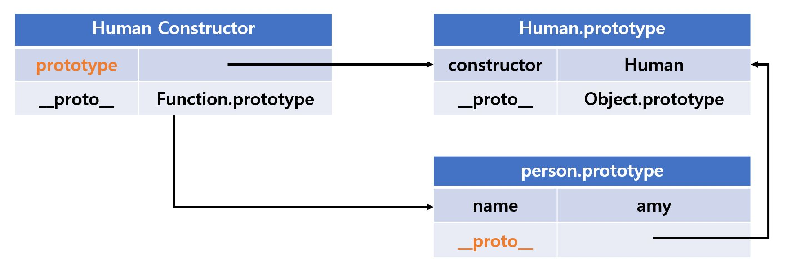

    </div>

    <br>

자, 다르게 동작하는 것도 알았는데, 프로토타입에 대한 의구심은 깊어져만 갑니다. 이번에는 위의 콘솔 출력에서 확인했듯 항상 출력되었던 `constructor 프로퍼티`를 확인해볼 때입니다.

<br>

### 프로토타입의 constructor 프로퍼티와 생성자 함수
> 모든 프로토타입은 constructor 프로퍼티를 갖습니다.

constructor 프로퍼티는 prototype 프로퍼티로 자신을 참조하고 있는 생성자 함수를 가리키며, 이런 연결은 생성자 함수가 생성될 때에 이뤄집니다.

- 프로세스로 이해해볼까요?
  ```js
  // 생성자 함수
  function Human(name){
    this.name = name;
  }

  // 인스턴스 생성
  const person = new Human('amy');

  console.log(person.constructor === Human);  // true
  ```

  1. Human 생성자 함수로 person 이라는 인스턴스(객체)를 생성합니다.
  2. person 객체는 constructor가 없지만 Human.prototype에는 constructor 프로퍼티가 있죠.
  3. 따라서 person 객체는 Human.prototype의 constructor 프로퍼티를 상속 받아 사용합니다.

  <br>

  - 이를 그려보면 이해가 빠르겠죠?

  <br>

  <div align='center'>

  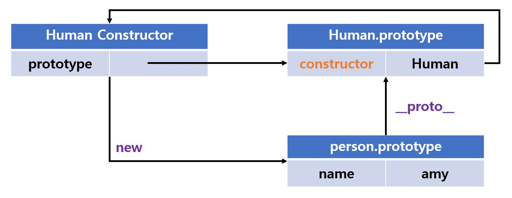

  </div>

  <br>

<br>

## 리터럴로 생성한 객체의 생성자 함수와 프로토타입
> 리터럴에 의한 객체 생성 방식처럼 명시적으로 new 연산자와 함께 생성자 함수를 호출해 인스턴스를 생성하지 않는 객체 생성 방식도 존재합니다.

리터럴로 생성된 객체도 프로토타입은 존재합니다. 단, 프로토타입의 constructor가 반드시 객체를 생성한 생성자 함수를 가리킨다고 단정할 순 없습니다.

- 아래 예제를 봅시다.
  ```js
  const num = 3;
  console.log(num.constructor === Number);

  const str = 'str';
  console.log(str.constructor === String);

  const bool = true;
  console.log(bool.constructor === Boolean);

  const obj = {};
  console.log(obj.constructor === Object);

  const add = function(a, b){ return a + b };
  console.log(add.constructor === Function);

  const arr = [1, 2, 3];
  console.log(arr.constructor === Array);

  const regexp = /is/gi;
  console.log(regexp.constructor === RegExp);
  ```
  - 각 타입의 리터럴로 선언했음에도 생성자 함수와 constructor 프로퍼티로 연결되어 있습니다. 그렇다면 이렇게 생각할 수 있겠죠? `리터럴에 의해 생성된 객체도 생성자 함수로 생성되잖아?`
  - 세부적으로는 다르지만, 큰 틀에서 보면 같습니다. 맞아요, 어려운 말입니다. 리터럴 표기법에 의해 생성된 객체도 상속을 위한 프로토타입이 필요합니다. 결국 `가상적인 생성자 함수`를 갖게 되는 거죠.

자세히 봅시다. 프로토타입은 생성자 함수가 생성될 때 같이 생성되고, prototype과 constructor 프로퍼티에 의해 연결되죠? 그렇다는 것은 **프로토타입과 생성자 함수는 항상 쌍(pari)으로 존재**한다는 뜻입니다.

<br>

잠깐 글이 길어지므로 내부 동작과 추상 연산에 대해 궁금하지 않다면 넘어가세요.

> 추상 연산(Abstract Operation), ECMAScript 사양에서 내부 동작 구현 알고리즘을 표현한 것으로 함수와 유사한 의사 코드(Pseudo Code)입니다.

<hr>
<br>
<hr>

## 생성자 함수로 생성한 객체를 평가하는 추상 연산

<br>

<div align='center'>

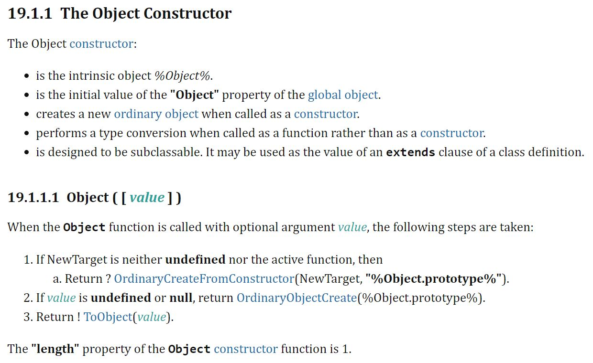

</div>

<br>

### 객체 생성자 함수
1. 고유한 개체 `%Object%`입니다.
2. 전역 객체에 선언된 객체 프로퍼티의 초기 값입니다.
3. 생성자로 호출될 때 새로운 일반 객체를 생성합니다.
4. 생성자가 아닌 함수로 호출될 때 타입 변환을 수행합니다.
5. 하위 분류가 가능하도록 설계되었습니다. 클래스 정의의 상속 값으로 사용할 수 있습니다.

<br>

### Object 함수가 선택적 인수 값으로 호출되면 다음 단계를 수행합니다.
1. NewTarget이 정의되지 않았거나 활성 함수인 경우
   1. 반환 : OrdinaryCreateFromConstructor(NewTarget, `"%Object.prototype%"`).
2. 값이 정의되지 않았거나 null인 경우
   1. 반환 : OrdinaryObjectCreate(`"%Object.prototype%"`).
3. 그 외는 값을 객체로 만들어 반환합니다.
   - 개체 생성자 함수의 "길이" 속성은 1입니다.

<hr>

## 리터럴로 생성한 객체를 평가하는 추상 연산

<br>

<div align='center'>

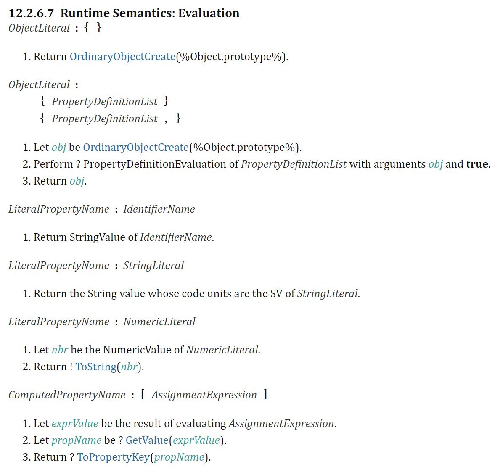

</div>

<br>

### 빈 객체 리터럴
1. 반환 : OrdinaryObjectCreate(`"%Object.prototype%"`)

<br>

### 프로퍼티와 함께 선언된 객체 리터럴
1. OrdinaryObjectCreate(`"%Object.prototype%"`)에 의해 빈 객체를 생성
2. 프로퍼티 정의 리스트와 프로퍼티 정의 연산을 거친 후 true인 인수 객체를 반환합니다.
3. 객체를 반환합니다.

<hr>
<br>
<hr>

자, 긴 글이 끝났습니다. 정리하자면, 리터럴에 의해 생성된 객체는 생성자 함수에 의해 생성된 객체가 아니므로 `생성 과정`, `스코프`, `클로저` 등의 미묘한 차이가 있지만 생성된 객체로서 동일한 특성을 갖게 되므로 본질적인 차이는 없다는 것이 이 페이지의 결론입니다.

<br>

## 프로토타입 생성 시점
> 모든 객체는 생성자 함수와 연결되어 있습니다.

다시 한 번 언급하자면, **프로토타입은 생성자 함수가 생성되는 시점에 같이 생성됩니다**.

### 사용자 정의 생성자 함수와 프로토타입 생성 시점
> 생성자 함수로서 호출할 수 있는 constructor는 함수 정의가 평가되어 함수 객체를 생성하는 시점에 프로토타입도 더불어 생성됩니다.

- 코드로 살펴 볼까요?
  ```js
  // 1번 : constructor 함수
  function Person(name) {
    this.name = name;
  }
  console.log(Person.prototype);  // {constructor: f}

  // 2번 : non-constructor 함수
  const Human = (name) => {
    this.name = name;
  }
  console.log(Human.prototype);   // undefined
  ```
  - 1번인 함수 선언문은 런타임 이전에 자바스크립트 엔진에 의해 먼저 실행(평가)되므로 가장 우선적으로 함수 객체가 되며, 프로토타입도 같이 생성됩니다. 그러나 2번인 화살표 함수는 생성자가 없습니다. 따라서 프로토타입도 생성되지 않아요.

위의 예제처럼 생성된 객체는 프로토타입을 가지고, Person.prototype의 프로토타입도 존재하므로 최상위 프로토타입은 Object.prototype이 됩니다. 그 말은 **생성된 프로토타입의 프로토타입은 언제나 Object.prototype**이라는 것입니다.
  
<br>

<div align='center'>

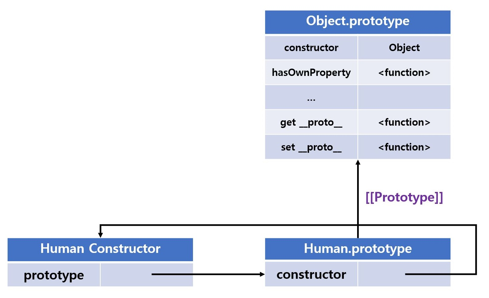

</div>

<br>

### 빌트인 생성자 함수와 프로토타입 생성 시점
> 모든 빌트인 생성자 함수는 전역 객체가 생성되는 시점에 생성되며, 생성된 프로토타입은 빌트인 생성자 함수의 prototype 프로퍼티에 바인딩됩니다.

일반 함수와 마찬가지로 `빌트인 생성자 함수가 생성되는 시점에 프로토타입이 생성됩니다`.

> 전역 객체(Gloabl Object)는 런타임 이전에 자바스크립트 엔진에 의해 생성되는 특수한 객체입니다. 나중에 더 자세히 알아봅니다.

<br>

<div align='center'>

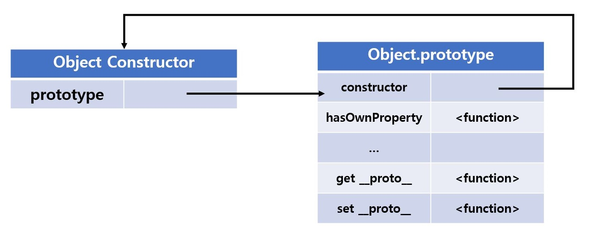

</div>

<br>

보시는 바와 같이 생성자 함수와 프로토타입은 이미 객체로 존재하며 객체를 생성하면 프로토타입은 생성된 객체의 `[[Prototype]]` 내부 슬롯에 할당됩니다. 이로써 생성된 객체가 프로토타입을 상속받게 되는 거죠.

<br>
<hr>
<br>

> 2021-09-24, 정리 중 식별된 내용으로 왜 다른지 이해해야 할 것

## ☑️ Google Chrome의 개발자 콘솔에서 `[[Prototype]]`이 출력
### 의문점
- 내부 슬롯에 접근이 불가능해서 __proto__를 통해 접근한다고 했는데, 실제 크로니움 브라우저의 개발자 도구에서 객체나 함수를 선언하고 조회하면 `[[Prototype]]`이 출력되네요. 언제 바뀐 걸까요?


### 정리 된 내용
> TODO

- 참조 [Link](https://developer.mozilla.org/ko/docs/Learn/JavaScript/Objects/Object_prototypes)

<br>

## ☑️ 왜 __proto__를 직접 사용하는 것을 금지할까요?
### 의문점
- __proto__를 직접 사용하지 말라고 하는데, 이유는 뭘까요?

### 정리 된 내용
`[[Prototype]]` 객체의 변경은 `최신 자바스크립트 엔진이 프로퍼티 접근을 최적화하는 방법`에 따라 모든 브라우저와 엔진에서 매우 느리게 동작합니다.

또한 `[[Prototype]]`을 직접 변경하여 객체의 상속이 수정되는 `obj.__proto__ = ...`문은 모든 코드가 접근이 가능하도록 의도치 않게 확장될 수 있으며, 이는 광범위하게 성능의 저하를 일으킵니다. 이런 부가 효과(Side Effect)는 단순히 문(statements)이 실행되는 때에만 그치지 않고 지속적으로 영향을 미치게 되죠. 따라서 성능을 향상시키고 싶다면 객체의 직접적인 `[[Prototype]]` 변경을 피해야 합니다. 

물론 그 해결책으로 많은 방법이 있으며, 그 중 하나인 `Object.create()`를 사용해 원하는 프로토타입 객체를 새로 생성할 수 있습니다.

<br>

- 참조 [Link](https://developer.mozilla.org/en-US/docs/Web/JavaScript/Reference/Global_Objects/Object/proto)
- 참조 [Link](https://developer.mozilla.org/ko/docs/Web/JavaScript/Inheritance_and_the_prototype_chain)

<br>

## ☑️ 왜 일반 객체의 프로토타입과 함수 객체의 프로토타입이 구분될까요?
### 의문점
- 뭐가 다른 건지 이해는 했는데... 왜 다른 걸까요? 설명이 필요해요.

### 정리 된 내용
> TODO

<br>

- 참조 [Link]()

<br>

☑️ 왜 일반 객체의 프로토타입과 함수 객체의 프로토타입이 구분될까요?
### 의문점
- `constructor 프로퍼티는 prototype 프로퍼티로 자신을 참조하고 있는 생성자 함수를 가리키며, 이런 연결은 생성자 함수가 생성될 때에 이뤄집니다`라고 이해했는데, 그럼 아래의 경우는 어떻게 설명해야 할까요?

- 해당 예제로 이해한 것은 `__proto__`는 Object.prototype만이 소유하고, 다른 객체들은 `빌려 쓴다`였습니다.
  ```js
  const circle = { radius: 5};

  // 1번
  console.log(circle.hasOwnProperty('__proto__'));
  // 결과 : false

  // 2번
  console.log(Object.getOwnPropertyDescriptor(Object.prototype, '__proto__'));
  // 결과 : {enumerable: false, configurable: true, get: ƒ, set: ƒ}

  // 3번
  console.log({}.__proto__ === Object.prototype);
  // 결과 : true
  ```
  - 이해한대로 작동하고, 정확한 것 같습니다.


- 그런데...?
  ```js
  // 3번 : 일반 객체
  console.log(({}).hasOwnProperty('prototype'));
  // 결과 : false
  ```
  - 이건 왜 false일까요?

### 정리 된 내용
> TODO

`{}`도 생성자 함수(new Object())에 의해 생성되므로 생성자 함수의 인스턴스인 건 알겠습니다.

<br>

<br>
<hr>
<br>

> 2021-09-29, <a href="https://github.com/inseong-so">InSeong-So</a>가 스터디원과 온라인 스터디 진행하면서 의문점을 갖고 해결한 내용

## ✅ 프로토타입 교체에 대해
### 의문점

<br>

### 정리 된 내용
- *정리해야함*


<hr>
<br>

## ✅ Object.create 메서드가 갖는 이점?
### 의문점

<br>

### 정리 된 내용
- *정리해야함*


<hr>
<br>

## ✅ `.prototype`과 `.__proto__`
### 의문점

<br>

### 정리 된 내용
- *정리해야함*


<hr>
<br>