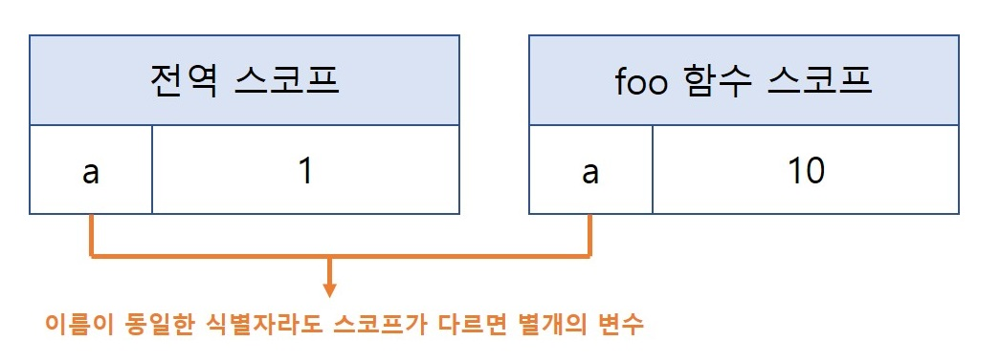
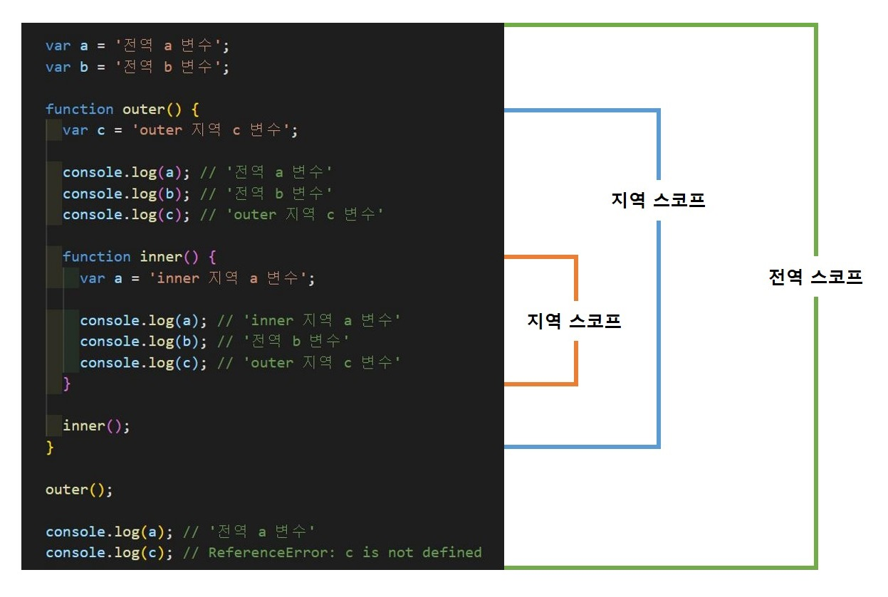
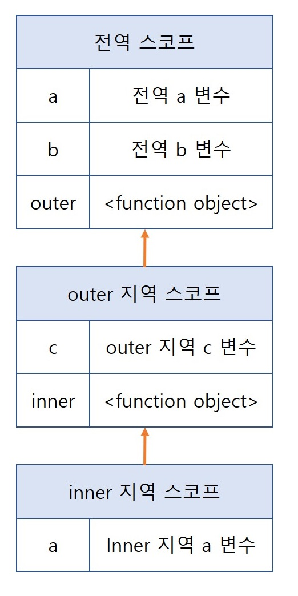

자바스크립트는 왜 이렇게 다른 언어들과 다르게 작동할까요? 그 원인 중 하나를 자세히 살펴봅니다!

## 스코프(Scope)
> 식별자가 유효한 범위를 말하며, 여러 규칙에 따라 동작합니다.

스코프는 변수, 함수와 아주 깊은 관련이 있죠. 우리가 보았던 함수 매개변수는 내부에선 유효하나 외부에서는 유효하지 못합니다. 이것이 바로 매개변수가 **참조할 수 있는 유효범위**인 스코프가 함수 몸체 내부로 한정되기 때문입니다.

모든 식별자(변수, 함수, 클래스 등)는 자신이 **선언된 위치**에 다른 코드가 자신을 참조할 수 있는지에 대한 유효 범위가 결정됩니다. 이를 스코프라고 합니다.

예제를 하나 볼까요? 아, 그리고 이번 장에서는 `var` 키워드를 자주 사용합니다. 이는 `let, const`가 가지는 스코프와 다르기 때문이니 참고해주세요!

```js
var a = 1;
function foo(){
  var a = 10;
  console.log(x); // ?
}

foo();

console.log(a);   // ?
```

전역 변수로서의 a와, 지역 변수로서의 a가 존재합니다. 이 때 자바스크립트 엔진은 스코프를 통해 어떤 변수를 참조할지 결정하는 **식별자 결정(Identifier Resolution)** 이 일어납니다. 결국 스코프란 식별자를 검색할 때 사용하는 규칙이라고도 할 수 있는 거죠.

자바스크립트 엔진은 코드를 실행할 때 코드의 문맥(context)을 고려합니다.
> **코드가 어디서 실행되며, 주변에 어떤 코드가 있는지**를 렉시컬 환경(Lexical Environment)라고 합니다. 이런 코드 문맥은 렉시컬 환경으로 이루어지며, 이를 구현한 것이 **실행 컨텍스트(Execution Context)** 입니다. 모든 코드는 실행 컨텍스트에서 평가되고 실행되며, 스코프는 실행 컨텍스트와 깊은 연관이 있으니 차후 자세히 다룹니다.

위 예제 코드의 맨 위에 선언된 변수 `a`는 어디서든 참조할 수 있지만 foo 함수 내부에 선언된 변수 `a`는 foo 함수 외부에서 참조할 수 없습니다. 즉, 식별자가 동일해도 유효한 범위인 스코프가 다르므로 별개의 변수가 되는 셈이죠.

<br>

<div align="center">



</div>

<br>

우리는 변수를 배우면서 식별자는 **유일한 값**이라고 이해했습니다. 스코프가 존재하지 않으면 동일한 식별자는 충돌을 일으키므로 하나 밖에 사용할 수 없게 되겠죠. 이처럼 프로그래밍 언어는 스코프(유효 범위)를 통해 변수 이름과 충돌을 방지합니다.

정리하자면 스코프 내에서의 식별자는 유일해야 하지만, 다른 스코프는 같은 식별자를 사용할 수 있으므로 **[네임 스페이스](https://ko.wikipedia.org/wiki/%EC%9D%B4%EB%A6%84%EA%B3%B5%EA%B0%84)(개체를 구분할 수 있는 범위)** 라고 할 수 있습니다.

<br>

> 참고 : `var` 키워드로 선언한 변수 중복 선언
- `var` 키워드로 선언된 변수는 같은 스코프라도 중복이 허용됩니다.
```js
function foo(){
  var a = 1;
  var a = 10;
  // 자바스크립트 엔진은 var 키워드를 생략하고 a = 10; 이라고 평가 합니다.
  console.log(a); // 10
}
```
- `let`, `const` 키워드로 선언된 변수는 같은 스코프 내에서 중복이 허용되지 않습니다.
```js
function bar(){
  let a = 1;
  let a = 10; // SyntaxError: Identifier 'a' has already been declared
}
```

<br>

### 스코프의 종류
> 프로그래밍 코드는 전역(Global)과 지역(Local)으로 나뉩니다. 

우리는 이미 전역, 지역에 대해 알고 있습니다. 표로 볼까요? 

| 구분 | 설명                  | 스코프                                               | 변수                           |
| ---- | --------------------- | ---------------------------------------------------- | ------------------------------ |
| 전역 | 코드의 가장 바깥 영역 | 전역 스코프<br>(Global Scope)                        | 전역 변수<br>(Global Variable) |
| 지역 | 함수 내부        | 지역 스코프<br>(Local Scope or Function-level Scope) | 지역 변수<br>(Local Variable)  |

<br>

<div align="center">

  

  <p>변수는 자신이 선언된 위치(전역 또는 지역)에 의해 스코프가 결정됩니다.</p>

</div>

<br>

- 전역 스코프(Global Scope) : 어떤 블록으로도 감싸져 있지 않은 경우, 전역 스코프 안에 존재합니다.
  - 제어문, 함수는 중괄호(`{}`)로 표기합니다. 즉 중괄호 밖에 있는 모든 변수는 **전역 변수**로서 존재하게 됩니다. 즉, 어디서라도 참조할 수 있습니다.

- 지역 스코프(Local Scope) : 어떤 블록으로 감싸져 있는 경우, 지역 스코프 안에 존재합니다.
  - 중괄호 안에 있는 모든 변수는 **지역 변수**로서 존재하고, 자신의 지역 스코프와 하위 지역 스코프에 한해 유효합니다.
  - 위의 그림에서, inner() 함수 내부의 지역 변수 `a`와 같은 이름의 전역 변수가 존재합니다. 이때 inner() 함수 내부에서 참조하는 변수 `a`는 전역 변수가 아닌 지역 변수 `a`입니다. 바로 스코프 체인(Scope Chain)을 통해 참조할 변수를 검색하는 식별자 결정(Identifier Resolution) 과정을 거쳤기 때문이에요!

<br>

### 스코프 체인(Scope Chain)
> 스코프는 함수의 중첩에 의해 계층적으로 구조를 가지며, 이렇게 연결된 것을 스코프 체인이라고 합니다.

<br>

<div align="center">

  

  <p>변수는 자신이 선언된 위치(전역 또는 지역)에 의해 스코프가 결정됩니다.</p>

</div>

<br>

변수를 참조할 때 자바스크립트 엔진은 스코프 체인을 통해 변수를 참조하는 코드의 스코프에서 시작하고, 상위 스코프 방향으로 이동하며 선언된 변수를 검색하여 결정(Identifier Resolution)합니다. 그렇기에 상위 스코프에서 선언한 변수를 하위 스코프에서도 참조할 수 있죠.

스코프 체인은 물리적인 실체로 존재합니다! 자바스크립트 엔진은 위 자료구조와 유사한 렉시컬 환경(Lexical Environment)를 실제로 생성합니다. 순서는 아래와 같아요.
> 그 전에! 렉시컬 환경는 뭘까요? 스코프 체인은 실행 컨텍스트의 렉시컬 환경를 단방향으로 연결합니다. 전역 레시컬 환경은 코드가 로드되면 곧바로 생성되고, 함수의 렉시컬 환경은 함수가 호출되면 곧바로 생성됩니다.

1. 변수 선언이 실행되면 변수 식별자가 자료구조(렉시컬 환경)에 키(Key)로 등록됩니다.
2. 변수 할당이 일어나면 자료구조의 변수 식별자에 해당하는 값을 변경합니다.

변수의 검색도 이러한 자료구조 상에서 이루어집니다. 그럼 함수는 어떨까요? 다음 예제를 봅시다.

```js
// 전역 함수
function foo(){
  console.log('전역 함수 foo');
}

function bar(){
  // 중첩 함수
  function foo(){
    console.log('지역 함수 foo');
  }

  foo();
}

bar();  // ?
```

자, 여기서 기억할 것은 함수 생성 시점과 호이스팅입니다.

함수 선언문으로 정의하면 `런타임 이전`에 함수 객체가 먼저 생성된 뒤, 함수 이름과 동일한 식별자를 암묵적으로 선언하고 생성된 함수 객체를 할당합니다.

이처럼 함수도 식별자에 할당되기 때문에 스코프를 갖으며, 일반 변수와 다를게 없습니다. 이로써 스코프는 `변수 식별에 유효한 범위 또는 규칙`이 아닌, `식별자를 검색하는 유효한 범위 또는 규칙`이 되겠네요!

<br>

### 함수 레벨 스코프(Function Level Scope)
> 코드 블록이 아닌 함수에 의해 지역 스코프가 생성됩니다.

다른 언어와 달리, 자바스크립트는 var 키워드로 선언된 변수는 `함수의 코드 블록`만을 지역 스코프로 인정하며 이를 함수 레벨 스코프라고 합니다.

```js
// 1
var a = 1;
if(true){
  var a = 10;
}

console.log(a);   // 10

// 2
var b = 1;
function change(){
  var b = 10;
  console.log(b);
}

change();         // 10
console.log(b);   // 10

// 3
var i = 10;
for(var i = 0; i < 5; i++){
  console.log(i); // 0, 1, 2, 3, 4
}

console.log(i);   // 5
```
- `var` 키워드의 특징으로, 함수 밖에서 선언한 함수 레벨 스코프 변수는 전역 범위를 가지며 함수 밖을 제외한 어디서든 접근할 수 있으며 의도치 않게 값이 변경될 수 있습니다.
- 이는 결국 `메모리 누수`, `어려운 디버깅` 등의 문제점을 가지고 있으며, `블록 레벨 스코프`가 탄생하는 원인이 되죠.

<br>

### 블록 레벨 스코프(Block Level Scope)
> 코드 블록에 의해 지역 스코프가 생성됩니다.

```js
let a = 1;
function change(){
  let a = 10;
  console.log(a);
}

change();       // 10
console.log(a); // 1
```
- `let`, `const`에 대해서는 뒤에서 다루기로 하죠.

<br>

### 렉시컬 스코프(Lexical Scope)
> 정적 스코프(Static Scope)라고도 합니다. 상위 스코프를 결정하는 중요한 스코프입니다.

아래의 코드를 보고, 생각해보도록 할까요?

```js
var a = 1;

function foo(){
  var a = 10;
  bar();
}

function bar(){
  console.log(a);
}

foo();  // ?
bar();  // ?
```

우리는 이 코드의 실행 결과를 이렇게 예측할 수 있습니다.
1. 함수를 **어디서 호출**했는지에 따라 함수의 상위 스코프를 결정한다.
2. 함수를 **어디서 정의**했는지에 따라 함수의 상위 스코프를 결정한다.

`1번`은 동적 스코프(Dynamic Scope)라 하며, 함수가 호출되는 시점에 동적으로 상위 스코프를 결정합니다. `2번`은 지금 항목에서 다루는 정적 스코프(Static Scope 또는 Lexical Scope)라고 하며, 함수 정의가 평가되는 시점에 정적으로 상위 스코프 결정합니다.

자바스크립트는 렉시컬 스코프를 따릅니다. 즉, 함수의 상위 스코프는 언제나 **자신이 정의된 스코프**입니다. 함수 정의가 실행되어 생성된 함수 객체는 이렇게 결정된 상위 스코프를 기억하고 있습니다. 함수가 호출될 때마다 상위 스코프를 참조해야하기 때문이죠.

렉시컬 스코프는 추후 등장하는 클로저(Closure)와 깊은 관계가 있으며, 매우 중요합니다. 추후 자세히 다룹니다!

<br>
<hr>
<br>

> 2021-09-11, <a href="https://github.com/karohani">karohani</a>와 스터디 중 식별된 추가적으로 공부가 필요한 내용들

## ✅ this가 바인딩 되는 시점은 렉시컬 환경 정의와 다르다?
### 의문점
- 자바스크립트의 렉시컬 환경(Lexical Environment)는 **선언된 시점**에서 스코프를 갖는데, `this`는... 다른가요? 아래 예제 코드를 보죠!

```js
const whatThis1 = function(){
  console.log(this);
}
const obj = {
  whatThis2: function(){
    console.log(this);
  }
}

console.log(whatThis2());     // Window
console.log(obj.whatThis2()); // {whatThis2: ƒ}
```

### 정리 된 내용
- *정리해야함*

- 참조 [Link](https://velog.io/@woobuntu/%EC%8B%A4%ED%96%89-%EC%BB%A8%ED%85%8D%EC%8A%A4%ED%8A%B8%EB%A0%89%EC%8B%9C%EC%BB%AC-%ED%99%98%EA%B2%BD%EA%B3%BC-this)

<hr>
<br>