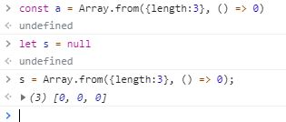

흔히들 사용하는 `변수`는 무엇일까요? 또 상수, 리터럴과 값은 무엇일까요? 이런 용어는 자바스크립트를 떠나 컴퓨터 과학에 널리 사용하는 용어입니다. 간략하지만 정확하게 짚고 넘어가죠.

## 변수(Variable)
> 값을 참조하는 이름으로, 값은 언제든 변할 수 있지만 이 값을 가리키는 이름은 변하지 않습니다.
 
컴퓨터는 모든 데이터를 0과 1로 제어합니다. 그러나 사람은 0과 1로 컴퓨터를 제어할 수 없죠. 그렇기에 사람에게 익숙한 형태로 데이터를 다룹니다.

익숙한 형태라 함은 숫자, 문자, 날짜 등이 있습니다. 이를 간단히 `데이터 타입(Data Type)` 이라고 부르죠. 변수는 이 데이터 타입을 다루기 위한 제 1단계입니다.

가령 우리가 5라는 데이터를 다루려고 한다면 5라는 데이터를 저장할 메모리가 필요합니다. 컴퓨터의 특정 연산을 거쳐 5라는 데이터는 어떤 메모리의 주소에 담기게 됩니다.

단, 그것을 사람이 알 수는 없으며 혹 알아도 많은 불편함이 생기겠죠? 이러한 이유로 `변수가 저장될 위치`를 기억하는 것이 바로 `변수`입니다.

```js
let a = 1;  // 변수의 선언과 할당
a = 2;      // 변수의 재할당
```

`let`이 무엇인지는 다음 장을 진행하면서 언급합니다.

<br>

## 상수(Constant)
> 변수와 동일한 값을 참조하는 이름이지만, 변하지 않는 값으로 약속된 변수입니다.

ES6에 진입하면서 생긴 개념으로 한 번 할당한 값을 바꿀 수 없는 변수입니다. 보통 `대문자와 밑줄`로 변수를 선언합니다. `const LIMIT_NUM = 10000;` 처럼 말이죠.

그럼 왜 등장한 것일까요?

이 내용을 알기 위해서는 기존 변수를 선언하는 식별자(identifier)인 `var`와 자바스크립트의 언어적 특성인 `호이스팅(Hoisting)`, `스코프(Scope)` 개념을 알아야 합니다. 깊게 다루기에는 너무 방대한 양이므로, 다른 페이지로 분리해서 정리하겠습니다.

`const`라는 상수형 식별자의 등장과 함께, 여러 번 할당해야하는 변수의 필요성도 뚜렷해졌습니다. 상술했던 `let`이 그것인데요, 이 식별자는 약어가 아니라 동사형 `let` 그 자체입니다.

`let a = 1;` 형태로 var 식별자와 동일한 코딩 표준으로 작성하며 여러 번 재할당해도 문제가 되지 않습니다.

<br>

## 식별자(Identifier)
> 변수, 상수, 함수의 이름으로 지칭한 것을 식별자라고 부릅니다.

자바스크립트에서 식별자를 정의하는 규칙이 있습니다.

### 식별자 정의 규칙
> 네이밍 컨벤션(Naming Convention)이라고도 합니다.

1. 식별자는 반드시 글자, 달러 기호($), 밑줄(_)로 시작합니다.
2. 식별자에는 글자, 숫자, 달러 기호, 밑줄만 쓸 수 있습니다.
3. 유니코드 문자도 쓸 수 있습니다.
4. **예약어** 는 식별자로 쓸 수 없습니다. 아래에서 예약어의 종류를 살펴볼 수 있습니다.

<br>

### 예약어의 종류
> ES5, 6 등 버전이 업데이트 되면서 추가되는 예약어도 있습니다.

<table>
  <thead>
    <th colspan="5">
      예약어의 종류(알파벳 순)
    </th>
  </thead>
  <tbody>
    <tr>
      <td>abstract</td>
      <td>arguments</td>
      <td>boolean</td>
      <td>break</td>
      <td>byte</td>
    </tr>
    <tr>
      <td>case</td>
      <td>catch</td>
      <td>char</td>
      <td>class</td>
      <td>const</td>
    </tr>
    <tr>
      <td>continue</td>
      <td>debugger</td>
      <td>default</td>
      <td>delete</td>
      <td>do</td>
    </tr>
    <tr>
      <td>extends</td>
      <td>false</td>
      <td>final</td>
      <td>finally</td>
      <td>float</td>
    </tr>
    <tr>
      <td>for</td>
      <td>function</td>
      <td>goto</td>
      <td>if</td>
      <td>implements</td>
    </tr>
    <tr>
      <td>import</td>
      <td>in</td>
      <td>instanceof</td>
      <td>int</td>
      <td>interface</td>
    </tr>
    <tr>
      <td>let</td>
      <td>long</td>
      <td>native</td>
      <td>new</td>
      <td>null</td>
    </tr>
    <tr>
      <td>package</td>
      <td>private</td>
      <td>protected</td>
      <td>public</td>
      <td>return</td>
    </tr>
    <tr>
      <td>short</td>
      <td>static</td>
      <td>super</td>
      <td>switch</td>
      <td>synchronized</td>
    </tr>
    <tr>
      <td>this</td>
      <td>throw</td>
      <td>throws</td>
      <td>transient</td>
      <td>true</td>
    </tr>
    <tr>
      <td>try</td>
      <td>typeof</td>
      <td>var</td>
      <td>void</td>
      <td>volatile</td>
    </tr>
    <tr>
      <td>while</td>
      <td>with</td>
      <td>yield</td>
      <td colspan="2"></td>
    </tr>
  </tbody>
</table>

<br>

### 식별자 표기 방식
이 식별자를 표기하는 방식에도 여러가지가 있는데요, 대표적인 방법으로는 아래와 같습니다.

```js
/* 카멜 케이스(camelCase) */
// 1. 변수
let firstName = 'aaa';
// 2. 상수
const FIRST_NAME = 'AAA';
// 3. 함수
const sum = () => {};

/* 파스칼 케이스(PascalCase) */
// 1. 클래스 등의 객체
class FirstName {};

/* 헝가리언 케이스(typeHungarianCase) */
// 1. type + identifier
let strFirstName = 'string name';
// 2. DOM(Document object model)의 Node(단수)
const $myID = document.querySelector('#myID');
// 3. DOM의 노드(복수)
const $$elem = document.querySelectorAll('.myID');
```

식별자 표기법은 절대적인 규칙이 아니기 때문에, 프로젝트와 특정 내부 규정에 따르는 것이 맞습니다!

<br>

## 리터럴(Literal)
> 오, 우리는 이미 사용했습니다. **let a = 1;** 그렇습니다. 1이 바로 리터럴이에요!

리터럴은 값을 프로그램 안에서 **직접 지정하는** 의미입니다. 즉, 리터럴은 값을 만드는 방법입니다. 자바스크립트는 개발자가 제공하는 리터럴 값을 받아 데이터를 작성합니다.

식별자와 리터럴의 분리된 개념을 정확하게 이해하고 넘어가봅시다.

```js
let a = 'a';
```

여기서 `a`는 식별자입니다. 당연히, `'a'`는 리터럴입니다. 그럼과 동시에 식별자 `a`의 **값** 입니다. 자바스크립트에서는 따옴표(큰 따옴표도 상관 없습니다)를 통해 식별자와 리터럴을 구분합니다!

리터럴 표기법에 대한 자세한 내용은 [여기](https://en.wikipedia.org/wiki/Literal_(computer_programming))를 참조하세요.

<hr>
<br>
<hr>

프로그램 코드를 작성함에 있어서, 우리는 컴퓨터에게 지시를 할 필요가 있습니다. `무엇을`, `어떻게` 쓸 것인지를 말이죠. 이 역하를 하는 단위가 이 페이지에서 설명할 것들입니다.

## 문(statement)
> 프로그램은 무엇을 기준으로 수행될까요? 수행 단계별로 묶어놓은 명령어의 집합, 그것이 바로 문입니다.

문의 구성은 여러가지입니다. 연산자(Operator), 표현식(Expression), 키워드(Keyword) 등으로 이루어지며, 반드시 세미콜론(;)으로 끝납니다.
- 단, 자바스크립트에서는 ASI(Automatic Semicolon Insertion, 자동 세미콜론 삽입)이라는 기능이 존재합니다. ASI는 자바스크립트 코드의 세미콜론 누락을 엔진이 자동으로 삽입하여 정상적으로 해석할 수 있게 합니다. 그러니 일반적인 세미콜론의 누락으로-제어문, 반복문 등의 세미콜론 누락이 아닌- 자바스크립트 실행에 문제가 일어나지 않으니 걱정하지 마세요!

그래서, 정확히 문이 뭘까요? 복잡하게 생각하지 말고, 세미콜론이 끝나기 전에 연결되어 있는 부분 부분이 전부 `문`이라고 이해하세요!

```js
/* 문들은 위에서 아래로 실행됩니다.
 * 물론 순서는 조건문, 반복문, 함수 호출 등으로 변경될 수 있습니다.
 */
let hello = 'hello!';
const YOU = 'Chalie';

while(true){
  if(hello === 'hello!'){
    console.log(hello + ' ' + YOU);
    hello = 'bye!'
  } else {
    console.log(hello + ' ' + YOU);
    break;
  }
}
```

<br>

## 표현식
> 엔진이 코드를 해석하면 `값`이 되는 구문입니다.

어렵게 표현하면 `하나의 값으로 평가되는` 것입니다. 종류는 아래와 같죠.
1. 값(리터럴)
2. 변수
3. 객체 프로퍼티
4. 배열 요소
5. 함수 호출
6. 피연산자와 연산자의 조합 등 

예를 들어볼까요?

```js
1       // 숫자 1입니다.
1 * 2   // 숫자 2입니다.
1 === 2 // 다르니까 false죠?
```

이처럼 평가된 이후의 값을 `표현식`이라고 합니다.

<br>

## 표현식과 문
> 그럼 헷갈릴 수 있습니다. 비슷하지 않나요? 이렇게 이해하세요. 문은 표현식의 **상위 집합** 입니다.

바로 코드를 볼까요?

```js
// 선언문(Declaration statement) : 표현식을 포함하는 문
let num;
// 할당문(Assignment statement) : 표현식이자 문 그 자체
num = 5;
// 선언문
const MAX_NUM = num * 10;
// 할당문
num = 0;
```

표현식은 값을 만들지만 그 이상의 행위는 불가능합니다. 그러나 문은 그 이상의 행위가 가능하죠. 따라서 표현식의 상위 집합이라고 이해하시는 것이 좋습니다.

<br>
<hr>
<br>

> 2021-09-04, <a href="https://github.com/inseong-so">InSeong-So</a>가 작성한 쪽지 시험을 스터디원과 함께 진행한 후 의문점을 가지다 해결한 내용

## ✅ var, let, const의 호이스팅
### 의문점
- var 만 호이스팅 된다고 하셨는데 let, const도 호이스팅 되지만 액세스가 불가능한 것으로 알고 있습니다.

### 정리 된 내용
- 작성자가 잘못 알고 있었으며, TDZ(Temporal Dead Zone)에 의해 `ReferenceError`가 나므로 호이스팅은 실행되나 액세스 시점에서 에러를 뱉는 것입니다.

- 참조 [Link](https://ui.toast.com/weekly-pick/ko_20191014)

<br>

## ✅ 표현식과 문의 구분

<div align=center>



</div>

<br>

### 의문점
- 책에는 `var a = 3;` 이라는 문은 변수의 선언과 할당을 같이 작성하는 함축 표현인데 이런 함축 문은 값으로 평가될 수 없어서 표현식이 아니라고 적혀있습니다... 그럼 `const arr = Array.from({length:3}, () => 0);`은 문 아닌가요?

### 정리 된 내용
> 맞습니다..! 정답은 문이었습니다. 글로만 이해해서 표현식이라고 생각했습니다.

토론 끝에 정리하자면 아래와 같습니다.

1. 선언문은 표현식을 포함(표현식이 아니다), 문입니다.
     - 선언문에는 좌항에 키워드가 들어갑니다.
     - var x; 또는 var x = 3; 모두 문입니다.
2. 할당문은 표현식이고, 문입니다.
     - x = 3; 또는 3 모두 표현식입니다.


<hr>
<br>